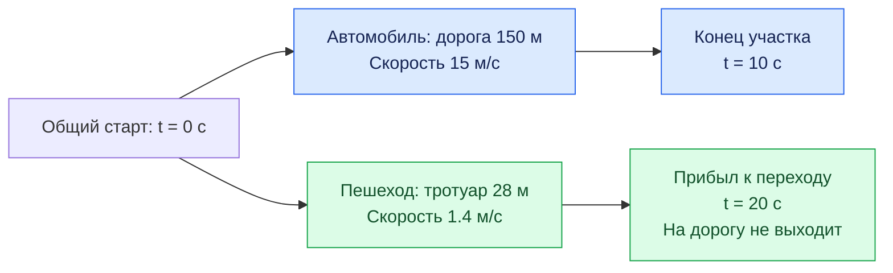
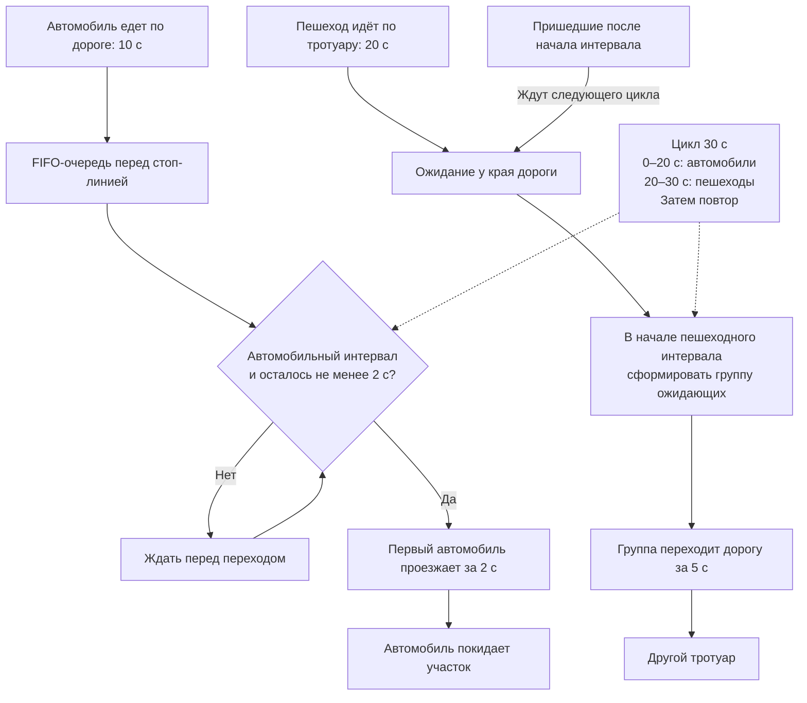
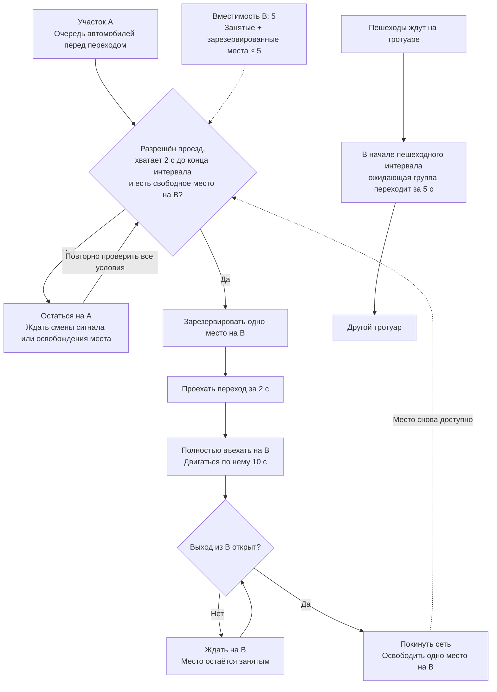
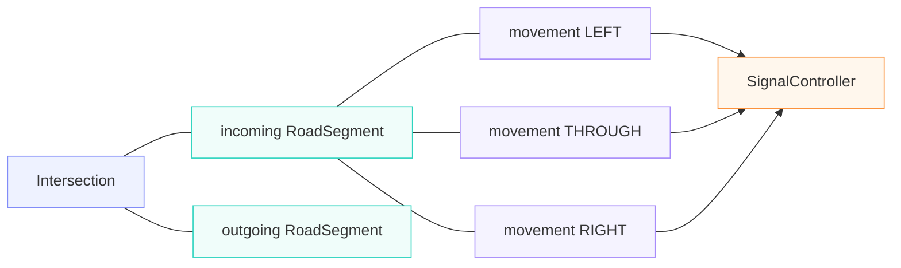
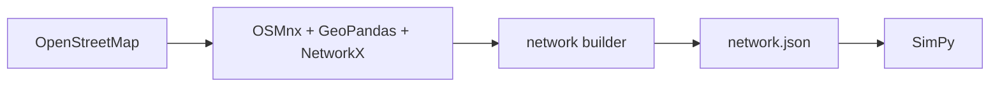
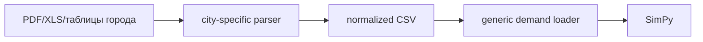

## План реализации проекта

Работа разбивается на этапы:

1. Освоение SimPy и дискретно-событийного подхода.
2. Simulation engine. Построение полноценной модели двух связанных перекрёстков на синтетических данных. Результат: работает универсальный simulation engine двух связанных перекрёстков с автомобилями, пешеходами, finite-capacity roads, spillback, saturation flow, Fixed/Binary actuated/Queue-aware и MetricsCollector.
3. Network builder. Автоматическое построение реальной дорожной сети по OpenStreetMap. Результат: выбранный участок OSM автоматически или полуавтоматически преобразуется в `network.json` совместимого формата.
4. Data pipeline + calibration/validation. Подготовка реальных данных Кургана, Калуги или Владивостока, калибровка, валидация. Результат: Signal Plan, Fixed-модель откалибрована и проверена на независимом наборе данных.
5. Итоговые эксперименты, подготовка статьи. Результат: проведено статистическое сравнение четырёх алгоритмов. Результаты работы оформлены в виде отчетной статьи.

Ключевой архитектурный принцип: этап 2 должен содержать почти всю симуляционную механику конечной работы. Этапы 3 и 4 не должны переписывать симулятор, а только готовить для него реальные `Network` и `Demand`.

Такое разделение позволяет не смешивать одновременно изучение SimPy, GIS/OSM и очистку старых транспортных данных и даёт рабочей группе ясные проверяемые результаты после каждого этапа.

## Этап 1. Познакомиться с возможностями SimPy

### Формальная задача этапа

Научиться представлять систему как набор взаимодействующих дискретных процессов и событий:

$$
S(t) \xrightarrow{\text{event}} S(t')
$$

Время в модели не меняется маленькими шагами. SimPy перескакивает от одного значимого события к следующему. Например:

| время | события |
| ------------------ | ---------------------------------- |
| $t = 12.4$ | автомобиль появился; |
| $t = 18.7$ | автомобиль доехал до перекрёстка; |
| $t = 23.0$ | загорелся зелёный; |
| $t = 24.8$ | автомобиль покинул очередь; |
| $t = 37.1$ | автомобиль достиг следующего перекрёстка. |

## Что рабочая группа должна освоить в SimPy

### Основные обьекты

| SimPy обьект | что представляет |
| ------------------ | ---------------------------------- |
| `Process` | процессы представляют из себя активные обьекты. Например: автомобили, пешеходы, светофоры, посетители магазина, запросы в службу поддержки |
| `Event` | события. Процессы используют отправку и реакцию или обработку событий для того чтобы организовать взаимодействие друг с другом или с Environment. Примеры событий: поступил новый запрос с службу поддержки или загорелся красный свет светофора или автомобиль появился на вьезде в перекресток |
| `Timeout` | Event специального типа, представляет из себя событие "прошел определенный промежуток времени". Такие событие позволяют процессу засыпать на заданное время, потом просыпаться. Или будить другие процессы |
| `Environment`      | Environment это среда проведения экспериментов, которая отвечает за координацию работы процессов |

Материалы: 
1. [SimPy - Basic Concepts](https://simpy.readthedocs.io/en/latest/simpy_intro/basic_concepts.html)
2. [SimPy — Process Interaction](https://simpy.readthedocs.io/en/latest/simpy_intro/process_interaction.html)

### Ресурсы совместного использования

Ресурсы совместного использования — ещё один способ моделировать взаимодействие процессов. В SimPy предусмотрены три категории ресурсов.

| Тип | Что моделирует | Основные операции | Пример |
| --- | --- | --- | --- |
| `Resource` | управляет доступом. Ограниченное число мест, которые процессы временно занимают | `request()` — занять; `release()` — освободить | Две заправочные колонки: одновременно обслуживаются два автомобиля |
| `Container` | управляет количеством. Запас однородного содержимого, выраженный числом | `put(n)` — добавить количество; `get(n)` — забрать | Бак с топливом: добавить 100 литров, забрать 20 |
| `Store` | Набор отдельных объектов | `put(obj)` — положить объект; `get()` — получить объект | Очередь автомобилей, у каждого есть ID, маршрут и время прибытия |

Во всех трёх случаях процесс может ждать через `yield`:
* у `Resource` — освобождения места, 
* у `Container` — достаточного количества или свободной ёмкости, 
* у `Store` — появления объекта или места для добавления. Обычный `Store` выдаёт объекты в порядке поступления — FIFO.

В проекте это можно применять так:

- **`Resource(capacity=1)`** — участок, через который одновременно проезжает один автомобиль. Автомобиль занимает его на время проезда, затем освобождает.
- **`Container(capacity=5, init=5)`** — пять свободных мест на участке. При резервировании выполняется `get(1)`, при выезде — `put(1)`. `level` показывает число свободных мест.
- **`Store()`** — очередь перед переходом. В ней хранятся сами объекты автомобилей или пешеходов; обслуживающий процесс забирает следующий через `car = yield queue.get()`.

У `Resource` значение `capacity` ограничивает число **одновременных пользователей**, а очередь ожидающих может быть длиннее. У `Container` хранится только количество; у `Store` сохраняются данные каждого объекта.

Материалы:

[SimPy — Ресурсы совместного использования](https://simpy.readthedocs.io/en/stable/topical_guides/resources.html)

### Monitoring

Сбора статистики модели.

Материалы:
  [SimPy — Monitoring](https://simpy.readthedocs.io/en/stable/topical_guides/monitoring.html)

## Учебные материалы

SimPy documentation

0. https://simpy.readthedocs.io/en/latest/simpy_intro/index.html
1. https://simpy.readthedocs.io/en/latest/topical_guides/simpy_basics.html
2. https://simpy.readthedocs.io/en/latest/topical_guides/environments.html
3. https://simpy.readthedocs.io/en/latest/topical_guides/events.html
4. https://simpy.readthedocs.io/en/latest/topical_guides/resources.html

Subject specific tutorials 
1. https://pythonhealthdatascience.github.io/intro-open-sim/lab/index.html
2. https://jckantor.github.io/cbe30338-2021/07.01-Introduction-to-Simpy.html
3. https://des.hsma.co.uk/intro_to_des_concepts.html

## Упражнения

Сначала моделируется цикл одного светофора. Затем упражнения последовательно собирают модель одной улицы: автомобили едут по дороге, пешеходы подходят по тротуару к регулируемому переходу и пересекают проезжую часть. Время измеряется в секундах, расстояние — в метрах, скорость — в метрах в секунду. Все числа ниже — учебные параметры, а не рекомендации по организации реального движения.

### 1. Симуляция одного светофора

**Задача.** Смоделировать один светофор, который сначала горит зелёным, затем жёлтым, затем красным и повторяет эту последовательность. Вывести журнал переключений с модельным временем.

**Условия:**

- в момент $t=0$ включается зелёный сигнал;
- зелёный горит 30 с, жёлтый — 5 с, красный — 25 с;
- после красного сразу включается зелёный и начинается следующий цикл; длительность полного цикла — 60 с;
- одновременно включён ровно один сигнал;
- моделирование длится 180 с; в этом упражнении рассматривается только переключение сигналов самого светофора.

**Что реализовать:**

1. Создать среду `simpy.Environment`.
2. Написать функцию-генератор `traffic_light(env, green_duration, yellow_duration, red_duration)` с повторяющимся циклом переключений.
3. При включении каждого сигнала сначала записывать его цвет и `env.now`, затем ожидать его длительность через `yield env.timeout(duration)`. Первая запись о зелёном должна появиться в момент $t=0$.
4. Зарегистрировать процесс через `env.process` и запустить моделирование вызовом `env.run(until=180)`.

**Проверка результата.** Журнал должен содержать следующие включения сигналов:

| Сигнал | Моменты включения, с |
| --- | --- |
| Зелёный | 0, 60, 120 |
| Жёлтый | 30, 90, 150 |
| Красный | 35, 95, 155 |

Всего получается девять записей за три цикла. Переключение в момент $t=180$ с не попадает в журнал: при числовом `until` SimPy останавливается до обработки событий на этой границе.

**Что освоить:** функцию-генератор, `yield`, `env.timeout`, `env.now`, `env.process`, повторение процесса и ограничение времени симуляции.

**Материалы:** [DataCamp — Introduction to the SimPy package](https://projector-video-pdf-converter.datacamp.com/30360/chapter2.pdf), слайды 3–7: генераторы, основные методы SimPy и пример светофоров. Остановка по времени описана в [SimPy — Environments](https://simpy.readthedocs.io/en/latest/topical_guides/environments.html).

### 2. Автомобиль едет по дороге, пешеход подходит к переходу

**Задача.** Смоделировать одновременное движение одного автомобиля по участку дороги и одного пешехода по тротуару до перехода. Определить, когда каждый участник достигнет конца своего участка пути.

**Условия:**

- в момент $t=0$ автомобиль въезжает на участок дороги длиной $L_{\mathrm{car}}=150$ м со скоростью $v_{\mathrm{car}}=15$ м/с;
- одновременно пешеход начинает идти по тротуару к переходу: ему осталось $L_{\mathrm{ped}}=28$ м, его скорость $v_{\mathrm{ped}}=1.4$ м/с;
- оба движутся с постоянной скоростью и пока не взаимодействуют; пешеход завершает движение у края проезжей части, не выходя на дорогу.

Время движения каждого участника:

$$
t_{\mathrm{travel}}=\frac{L}{v}.
$$

**Схема движения.** Обе ветви запускаются одновременно в одной среде моделирования.



**Что реализовать:**

1. Создать одну среду `simpy.Environment` и два процесса: движение автомобиля и движение пешехода.
2. В каждом процессе записать время старта, дождаться `env.timeout(L / v)` и записать время прибытия.
3. Запустить оба процесса через `env.process` до начала выполнения симуляции.
4. Вывести журнал: время, тип участника, событие «начал движение» или «прибыл».

**Проверка результата.** Автомобиль завершает участок в момент $t=10$ с, пешеход приходит к переходу в момент $t=20$ с. Общее модельное время — 20 с: процессы идут одновременно, их длительности не складываются.

**Что освоить:** `env.now`, `yield`, `env.timeout`, `env.process` и совместное выполнение процессов в одной среде.

### 3. Потоки автомобилей и пешеходов на одной улице

**Задача.** Вместо двух заранее заданных участников смоделировать случайное появление автомобилей на въезде и пешеходов на тротуаре. Каждый новый участник должен самостоятельно пройти путь из упражнения 2.

**Условия:**

- автомобили появляются с интенсивностью 360 автомобилей в час;
- пешеходы появляются с интенсивностью 180 пешеходов в час;
- оба генератора независимы; перед первым появлением, как и перед последующими, генератор ждёт случайный интервал;
- новые участники появляются в течение 600 с, после чего генераторы прекращают работу, а уже появившиеся участники заканчивают путь;
- длины участков и скорости остаются прежними; остановок и взаимодействий пока нет.

Интенсивности в единицах модельного времени:

$$
\lambda_{\mathrm{car}}=\frac{360}{3600}=0.1\ \mathrm{s}^{-1},
\qquad
\lambda_{\mathrm{ped}}=\frac{180}{3600}=0.05\ \mathrm{s}^{-1}.
$$

Интервалы между появлениями:

$$
\Delta t_{\mathrm{car}}\sim\mathrm{Exp}(\lambda_{\mathrm{car}}),
\qquad
\Delta t_{\mathrm{ped}}\sim\mathrm{Exp}(\lambda_{\mathrm{ped}}).
$$

**Что реализовать:**

1. Написать отдельные процессы-генераторы автомобилей и пешеходов.
2. Получать интервал через `random.expovariate(lam)`, передавая интенсивность в секунду. Если следующее появление приходится на момент $t\ge600$ с, завершать генератор.
3. При каждом появлении присваивать участнику уникальный идентификатор и запускать его процесс движения, не дожидаясь завершения предыдущего участника.
4. Сохранять время появления и прибытия каждого участника; использовать фиксированный seed для воспроизводимости.

**Проверка результата.** При повторном запуске с тем же seed журнал совпадает. Каждый автомобиль проводит в пути 10 с, каждый пешеход — 20 с. За 600 с ожидается в среднем 60 автомобилей и 30 пешеходов, но в отдельном запуске количество случайно и не обязано совпадать с этими значениями. После завершения всех процессов число прибывших равно числу появившихся отдельно для каждого типа участников.

**Что освоить:** процессы-генераторы, случайные интервалы, единицы интенсивности и одновременное движение многих участников.

### 4. Очереди перед регулируемым пешеходным переходом

**Задача.** Добавить в конец автомобильного участка регулируемый пешеходный переход. Автомобили должны останавливаться перед ним, а пешеходы — ждать у края дороги. Организовать их движение так, чтобы разрешённые интервалы не пересекались.

**Условия:**

- использовать потоки и времена подхода из упражнения 3;
- автомобиль после 10 с движения присоединяется к очереди перед стоп-линией, пешеход после 20 с ходьбы — к очереди у перехода;
- с момента $t=0$ повторяется учебный цикл длительностью 30 с: первые 20 с разрешён проезд автомобилей, следующие 10 с отведены пешеходам;
- проезд одного автомобиля через переход занимает 2 с; автомобили обслуживаются по одному в порядке прибытия;
- ширина перехода — 7 м, скорость пешехода — 1.4 м/с, поэтому переход занимает 5 с;
- в начале пешеходного интервала все уже ожидающие пешеходы начинают переход одновременно; пришедшие позже ждут следующего цикла;
- автомобиль может начать проезд только тогда, когда успеет полностью завершить его до конца автомобильного интервала. Завершить проезд ровно на границе интервала допустимо.

В этом упражнении используется упрощённый цикл из двух разрешённых интервалов. Жёлтые фазы в модели движения, защитные интервалы и полноценная логика контроллера появятся на этапе 2 проекта.

**Схема очередей и разрешённых интервалов.** Автомобили проходят по одному, пешеходы — группой, сформированной в начале своего интервала.



**Что реализовать:**

1. Создать две очереди `simpy.Store`: для автомобилей и пешеходов, достигших перехода.
2. Написать процесс контроллера, который хранит текущий разрешённый интервал и сообщает о его смене через `Event`.
3. Написать процесс обслуживания автомобильной очереди: дождаться разрешения, проверить остаток интервала и пропускать автомобили последовательно.
4. Написать процесс обслуживания пешеходной очереди: в начале пешеходного интервала выбрать ожидающую группу и смоделировать её переход.
5. Записывать для каждого участника время входа в очередь, начала и завершения проезда или перехода. Для прибытия ровно на границе интервалов явно задать порядок обработки событий и одинаково применять его во всех запусках.
6. После отключения генераторов продолжать обслуживание до выхода всех участников, затем завершать симуляцию; бесконечный процесс контроллера сам по себе не даст завершиться вызову `env.run()` без условия остановки.

**Проверка результата.** Сначала отключить случайные генераторы и задать прибытия непосредственно к переходу: три автомобиля в момент $t=0$ и два пешехода в момент $t=1$ с. Автомобили проходят в интервалах 0–2, 2–4 и 4–6 с; пешеходы ждут до $t=20$ с и переходят в интервале 20–25 с. Затем включить случайные потоки и проверить сохранение FIFO для автомобилей, отсутствие движения на запрещённом интервале и отсутствие одновременного нахождения автомобилей и пешеходов на переходе.

**Что освоить:** `Store`, FIFO, ожидание событий, взаимодействие процессов и отделение движения от ожидания в очереди.

### 5. Затор за переходом блокирует проезд автомобилей

**Задача.** Продолжить модель упражнения 4: добавить после перехода второй дорожный участок B, на котором помещается не более пяти автомобилей. Показать, как заполнение B останавливает выпуск автомобилей с участка A перед переходом, даже когда автомобилям разрешён проезд.

**Условия:**

- участок A — дорога перед переходом; его вместимость в этом упражнении пока не ограничена;
- участок B вмещает пять автомобилей, включая зарезервированные места для уже начавших проезд через переход;
- после полного въезда на B автомобиль едет по нему 10 с и покидает сеть;
- автомобиль может начать проезд через переход только при разрешённом автомобильном интервале, достаточном остатке времени и наличии места на B;
- место на B резервируется перед началом проезда. Если автомобиль ожидал место и за это время разрешённый интервал закончился, нужно повторно проверить разрешение и не занимать переход в ожидании;
- пешеходы продолжают обслуживаться по правилам упражнения 4: автомобиль, ожидающий место на B, стоит перед переходом и не перекрывает его.

**Схема блокирования участка A.** Проверка выполняется для первого автомобиля в очереди. Ожидание всегда происходит перед переходом.



**Что реализовать:**

1. Представить свободные места на B через `simpy.Container` с `capacity=5` и `init=5`.
2. До начала проезда резервировать одно место на B. После завершения проезда переносить автомобиль с A на B, затем моделировать его движение по B.
3. При выходе автомобиля из B возвращать одно свободное место.
4. Записывать число занятых и зарезервированных мест на B, длину очереди на A и время ожидания из-за заполнения B.
5. Выполнить два запуска с одинаковыми появлениями участников: со свободным выходом из B и с временно закрытым выходом в интервале 0–60 с. При закрытом выходе закончившие движение по B автомобили остаются на нём и продолжают занимать места.

**Проверка результата.** Для наглядного отдельного теста поставить восемь автомобилей в очередь на A в момент $t=0$, оставить B пустым и закрыть его выход до $t=60$ с. Первые пять автомобилей займут или зарезервируют все места на B; остальные три останутся перед переходом. Число занятых и зарезервированных мест никогда не превышает пяти. В пешеходные интервалы переход остаётся доступен пешеходам. После открытия выхода из B автомобили снова получают возможность проезда при разрешающем сигнале.

Так проявляется начало spillback: заполненный участок B блокирует выпуск с A. Ограничение вместимости самого A и распространение затора до предыдущего перекрёстка добавляются на этапе 2.

**Что освоить:** `Container`, резервирование и освобождение вместимости, повторная проверка условий после ожидания и влияние downstream-затора на очередь перед переходом.

### 6. Метрики

Для каждой заявки/автомобиля сохранять как минимум:

- `created_at`;
- `queue_entered_at`;
- `queue_left_at`;
- `finished_at`.

Вычислять:

$$
T_{\mathrm{trip}} = t_{\mathrm{finish}} - t_{\mathrm{create}};
$$

$$
T_{\mathrm{queue}} = t_{\mathrm{leave\_queue}} - t_{\mathrm{enter\_queue}}.
$$

### Критерий завершения этапа 1

Каждый участник самостоятельно реализует модель:


После этого знаний SimPy достаточно, чтобы переходить к транспортной модели.

## Этап 2. Модель двух перекрёстков на выдуманных данных

### Базовая формализация модели

Граф модели можно представить в виде NetworkX `DiGraph` примерно так:



Для каждого направленного участка $e$:

$$
e = (u,v)
$$

храним как минимум

$$
L_{e},n_{e},t_{e}^{0},C_{e},N_{e}(t)
$$

где $L$ — длина, $n$ — полосы, $t^{0}$ — свободное время проезда, $C$ — вместимость, $N(t)$ — текущее количество машин.

А поток можно представить как:

$$
\lambda_{e}(t)
$$

кусочно-постоянный на интервалах 5 или 15 минут.

То есть в 7:00–7:15:

$$
\lambda = 420\ \mathrm{veh}/\mathrm{h},
$$

а в 7:15–7:30:

$$
\lambda = 510\ \mathrm{veh}/\mathrm{h}.
$$

При отсутствии индивидуальных времён проезда из таких данных естественно генерировать входы как **piecewise non-homogeneous Poisson process**. Это достаточно серьёзная стохастическая модель для учебной работы и при этом проста для реализации.

Есть одна особенно важная деталь SimPy, которую стоит зафиксировать.

Пусть у участка есть:

```python
free_space = simpy.Container(
    env,
    capacity=capacity,
    init=capacity,
)
```

При въезде автомобиля:

```python
yield segment.free_space.get(1)
```

а при выезде:

```python
yield segment.free_space.put(1)
```

Но место на предыдущем участке надо освобождать **не тогда, когда автомобиль подошёл к светофору**, а только когда он реально пересёк стоп-линию и смог занять следующий участок.

То есть переход логически должен выглядеть так:

* доехал до конца edge A
* встал в очередь LEFT
* дождался разрешающей фазы
* дождался свободного места на edge B
* занял edge B
* освободил место на edge A

Именно это автоматически даёт **обратный поток**:

* B заполнен
* машины не могут уйти из A
* очередь A растёт
* A заполняется
* предыдущий перекрёсток тоже начинает блокироваться

Это, на мой взгляд, одна из самых сильных частей выбранной модели. Мы получаем сетевые заторы без симуляции координат, дистанций и ускорений.

А `simpy.Store` для `left` / `through` / `right` в этом случае содержит автомобили, уже прибывшие к стоп-линии соответствующего движения.

### Формальная задача

Построить минимальную полноценную транспортную дискретно-событийную модель двух связанных регулируемых перекрёстков, которая содержит почти всю механику будущей реальной модели.

Сеть представляется ориентированным графом:

$$
G = (V,E),
$$

где $V$ — перекрёстки и граничные точки моделируемой области, $E$ — направленные участки дорог.

Минимальная конфигурация должна содержать два последовательных перекрёстка A и B на основной улице и по одному или нескольким боковым направлениям. Между A и B обязательно должен быть участок конечной вместимости, чтобы можно было моделировать взаимодействие перекрёстков и spillback.

### Модель дорожного участка

Для каждого направленного участка $e = (u,v)$ хранятся:

- $L_e$ — длина;
- $n_e$ — число полос;
- $v_e^{\mathrm{free}}$ — свободная скорость;
- $t_e^{\mathrm{free}} = \frac{L_e}{v_e^{\mathrm{free}}}$ — свободное время проезда;
- $C_e$ — вместимость;
- $N_e(t)$ — текущее количество автомобилей.

Начальную оценку вместимости можно задавать параметрически:

$$
C_e = \left\lfloor L_e n_e k_{\mathrm{jam}} \right\rfloor,
$$

где $k_{\mathrm{jam}}$ — условная плотность при заторе.

На этапе 2 точное значение $k_{\mathrm{jam}}$ не критично: это параметр модели, который позднее можно калибровать.

### Модель автомобиля

Минимальное состояние `Vehicle`:

- `id`;
- `created_at`;
- `route`;
- `current_segment`;
- `next_segment`;
- `movement`;
- `queue_entered_at`;
- `stops`;
- `finished_at`.

Жизненный цикл автомобиля:

1. Появиться на входе сети.
2. Занять место на `RoadSegment`.
3. Провести на участке $t_{\mathrm{free}}$.
4. Определить следующий манёвр.
5. Встать в очередь соответствующего движения.
6. Дождаться разрешающей фазы.
7. Дождаться свободного места на downstream-участке.
8. Занять следующий участок.
9. Только после этого освободить место на предыдущем участке.
10. Повторять до выхода из сети.

### Ключевое правило spillback

Автомобиль в очереди перед стоп-линией продолжает занимать место на предыдущем `RoadSegment`. Следовательно:


Это позволяет получить сетевой затор без координатной микросимуляции, ускорений и дистанций.

### Очереди манёвров

Для каждого входа к перекрёстку моделируются отдельные movement queues:

- `left`;
- `through`;
- `right`.

Формально движение:

$$
m = (e_{\mathrm{in}},e_{\mathrm{out}}).
$$

Для перекрёстка $v$:

$$
M_v = \{m_1,m_2,\ldots,m_k\}.
$$

Светофорная фаза разрешает набор совместимых movements, а не просто «направление дороги».

Допущение первой версии: очереди `left` / `through` / `right` независимы. Для реальной сети это может завышать пропускную способность, если одна физическая полоса обслуживает одновременно несколько манёвров. В дальнейшем при необходимости можно перейти к `LaneGroup`.

### Пропускная способность зелёной фазы

Включение зелёного не означает мгновенный выпуск всей очереди.

Для каждого `movement` задаётся поток насыщения (saturation flow) $s_m$ — интенсивность выпуска автомобилей при наличии очереди, разрешающей фазе и свободном downstream-участке. Единица измерения — автомобилей в час.

Из него вычисляется интервал между последовательными автомобилями $h_m$. Если численное значение $s_m$ задано в автомобилях в час, то интервал в секундах равен:

$$
h_m = \frac{3600}{s_m}.
$$

Например, при $s_m = 2000$ автомобилей в час:

$$
h_m = \frac{3600}{2000} = 1.8\ \mathrm{s}.
$$

Например, если $h_m = 1.8$ секунды, автомобили проходят стоп-линию последовательно с таким интервалом, пока фаза разрешает движение и downstream-участок имеет свободную вместимость.

### Пешеходы

Пешеходы добавляются уже на этапе 2.

Минимальное состояние `Pedestrian`:

- `arrival_time`;
- `crossing_id`.

Пешеходский поток можно сначала моделировать как:

$$
\Delta t_{\mathrm{ped}} \sim \mathrm{Exp}(\lambda_{\mathrm{ped}}).
$$

Пешеход ожидает разрешающей фазы.

Минимальное время перехода:

$$
t_{\mathrm{cross}} = t_{\mathrm{startup}} + \frac{W}{v_{\mathrm{walk}}},
$$

где $W$ — ширина перехода, $v_{\mathrm{walk}}$ — принятая скорость пешехода.

Контроллер обязан обеспечить достаточное время перехода и не терять запрос: `pedestrian_request` остаётся активным, пока переход фактически не обслужен.

### Три контроллера

Светофоры описываются следующими возможными типами поведения

#### 1. Fixed

Фиксированный цикл, например:

- Main green — 35 s;
- yellow — 3 s;
- clearance — 2 s;
- Side green — 20 s;
- yellow — 3 s;
- clearance — 2 s.

Цикл повторяется независимо от спроса.

#### 2. Binary actuated

Контроллер видит только бинарные датчики:

- $D_m(t) \in \{0,1\}$ — есть машина / нет машины;
- $P_k(t) \in \{0,1\}$ — есть запрос пешехода / нет запроса.

Обязательные ограничения:

$$
g_{\min} \le g \le g_{\max};
$$

- жёлтая фаза;
- защитный интервал;
- запрет конфликтующих movements;
- максимальное ожидание второстепенного направления;
- максимальное ожидание пешехода;
- проверка свободной downstream-вместимости.

Пример логики:

- пока $g < g_{\min}$ — фазу нельзя завершать;
- после $g_{\min}$ при отсутствии спроса на текущей фазе и наличии competing demand можно переключаться;
- при $g \ge g_{\max}$ при наличии competing demand текущая фаза завершается;
- пешеходский запрос сохраняется до обслуживания.

#### 3. Queue-aware

Контроллер имеет количественную информацию:

- $Q_m(t)$ — длина очереди;
- $W_m^{\max}(t)$ — максимальное время ожидания.

Можно определить оценку фазы:

$$
\mathrm{Score}(p) = \alpha \sum_{m \in p} Q_m + \beta \max_{m \in p} W_m.
$$

Далее выбирается наиболее приоритетная допустимая фаза с соблюдением min/max green, yellow, clearance и требований к пешеходам.

Time-of-day на этапе 2 можно не реализовывать как отдельный исследовательский алгоритм. На синтетическом постоянном спросе он почти эквивалентен набору Fixed-программ. Логичнее добавить его на этапе 4, когда появится реальный временной профиль.

### Синтетические сценарии

Нужно проверить не один набор потоков, а несколько режимов:

- Low — низкая нагрузка всех направлений.
- Main-heavy — высокая нагрузка главной улицы, малая боковых.
- Balanced — сопоставимая нагрузка направлений.
- Saturated — высокая нагрузка всех направлений.
- Burst — резкие временные всплески потока.
- Downstream block — сценарий, в котором участок после перекрёстка регулярно заполняется.

Для каждого сценария все контроллеры должны получать один и тот же заранее сгенерированный спрос.

Лучше заранее сгенерировать последовательности arrivals и маршрутов, а потом воспроизводить их для каждого алгоритма. Это сильнее, чем просто одинаковый seed: получается common random numbers и уменьшается дисперсия попарного сравнения.

### Метрики этапа 2

#### Автомобильные

- среднее время поездки;
- средняя задержка;
- P95 задержки;
- средняя и максимальная очередь;
- throughput;
- число незавершивших маршрут автомобилей;
- количество остановок.

#### Пешеходные

- среднее ожидание;
- максимальное ожидание;
- P95 ожидания;
- доля слишком долго ожидающих.

Также нужно писать временные ряды:

`time`, `intersection`, `movement`, `queue_length`.

Это позволит анализировать развитие очереди и spillback во времени.

### Рекомендуемая архитектура системы

```text
simulation/
    vehicle.py
    pedestrian.py
    movement.py
    signal.py
    phase.py

network/
    road_segment.py
    intersection.py

demand/
    arrivals.py
    routes.py
    pedestrians.py

controllers/
    base.py
    fixed.py
    binary_actuated.py
    queue_aware.py

metrics/
    collector.py
    trip_metrics.py
    queue_metrics.py
    pedestrian_metrics.py
```

Главный интерфейс должен быть универсальным:

```python
Simulation(
    network=network,
    demand=demand,
    controller=controller,
)
```

Контроллер не должен знать внутреннее устройство автомобиля.

Его интерфейс должен зависеть от текущего состояния сигналов и доступных ему sensor/queue данных, например:

```python
state = detector_state()

next_phase = controller.decide(
    time=env.now,
    current_phase=current_phase,
    state=state,
)
```

Таким образом одна и та же модель запускается с разными алгоритмами управления.

### Критерий завершения этапа 2

После этапа 2 симулятор не должен знать, является сеть синтетической или реальной. Он получает `Network`, `Demand` и `Controller` и возвращает `Metrics`.

Это основной simulation engine будущего проекта.

## Этап 3. Построить реальную сеть из OpenStreetMap

### Формальная задача этапа

По выбранной географической области $R$ построить ориентированный граф:

$$
G = (V,E),
$$

где:

- $V$ — логические автомобильные перекрёстки;
- $E$ — однонаправленные дорожные участки между перекрёстками.

Задача этапа 3 — не моделировать движение, а превратить GIS/OSM-данные в стандартный объект `Network`, который уже умеет читать симулятор этапа 2.

### Основные библиотеки

#### OSMnx

OSMnx используется для:

- загрузки дорожного графа из OpenStreetMap;
- получения геометрии и атрибутов дорог;
- упрощения графа;
- работы с направленностью дорог;
- консолидации физически одного перекрёстка, разбитого на несколько OSM nodes;
- получения исторического snapshot OSM;
- сохранения/загрузки графа.

Учебный материал:

[OSMnx — Getting Started](https://osmnx.readthedocs.io/en/stable/getting-started.html)

#### NetworkX

NetworkX используется как основное представление графа после загрузки OSM:

- `DiGraph` / `MultiDiGraph`;
- обход графа;
- маршруты;
- хранение атрибутов рёбер и вершин;
- поиск соседей;
- построение допустимых переходов между сегментами.

Учебный материал:

[NetworkX — Introduction](https://networkx.org/documentation/stable/reference/introduction.html)

#### GeoPandas

GeoPandas используется для пространственных операций:

- точки обследований;
- OSM nodes;
- pedestrian `crossings`;
- CRS;
- spatial join;
- поиск ближайшего OSM-объекта к точке из КСОДД;
- проверка и визуальная отладка соответствий.

Учебный материал:

[GeoPandas — Introduction](https://geopandas.org/en/latest/getting_started/introduction.html)

### Что должно попасть в Network

Для каждого `RoadSegment`:

- `id`;
- `from_intersection`;
- `to_intersection`;
- `osm_id`;
- `length`;
- `lanes`;
- `speed`;
- `free_flow_time`;
- `capacity`;
- `geometry`;
- `road_name`;
- `oneway`.

Для каждого `Intersection`:

- `id`;
- `coordinates`;
- `incoming_segments`;
- `outgoing_segments`;
- `allowed_movements`;
- `has_traffic_signal`;
- `crossings`.

Для каждого `Movement`:

- `incoming_segment`;
- `outgoing_segment`;
- `type` = `left` / `through` / `right`;
- `signal_group` или phase compatibility;
- `lane_group` при наличии.

Для каждого `Crossing`:

- `id`;
- `intersection_id`;
- `geometry`;
- `width` при наличии;
- связанные pedestrian phases.

### Построение графа

Базовый pipeline:

1. Загрузить выбранную область через OSMnx.
2. Оставить drive-сеть.
3. Спроецировать координаты в метрическую CRS.
4. Провести topological simplification.
5. Объединить узлы, относящиеся к одному физическому перекрёстку.
6. Отфильтровать выбранные 3–6 реальных перекрёстков и их соединяющие сегменты.
7. Для каждого сегмента вычислить/дополнить атрибуты, необходимые симулятору.
8. Для каждого перекрёстка построить допустимые movements.
9. Отдельно прикрепить pedestrian `crossings`.

### Проблема: один физический перекрёсток может быть несколькими OSM nodes

На разделённых дорогах один реальный перекрёсток может выглядеть как несколько близких узлов.

Поэтому нужно использовать или адаптировать OSMnx `consolidate_intersections()`, иначе в SimPy вместо одного перекрёстка может случайно появиться несколько искусственных.

### Не смешивать автомобильные перекрёстки и pedestrian crossings

Pedestrian crossing не должен автоматически становиться автомобильной вершиной графа.

Лучше представлять:

Road graph:

- `Intersection`;
- `RoadSegment`.

Отдельно:


Это позволяет независимо моделировать пешеходский запрос и светофорную фазу, не ломая автомобильную топологию.

### Разрешённые манёвры

Для каждого перекрёстка нужно построить:

$$
M_v \subseteq \mathrm{In}(v) \times \mathrm{Out}(v).
$$

Первичную классификацию можно делать по углам между сегментами:

- примерно прямое направление -> `through`;
- положительный/отрицательный поворот -> `left`/`right` в зависимости от принятой системы.

Но обязательно нужно учитывать:

- `oneway`;
- `turn:lanes`;
- запрещённые повороты;
- OSM relation `type=restriction`;
- реальные знаки и ПОДД, если они доступны.

Для сети всего из 3–6 перекрёстков итоговые movements лучше вручную проверить после автоматического построения.

### Число полос

OSM `lanes=*` можно использовать как исходное значение, но оно часто неполное или неоднозначное.

Нужно определить правило:

- если `lanes` заполнено — использовать;
- если нет — взять разумное значение по типу дороги;
- затем вручную проверить исследуемый коридор по спутниковым снимкам/панорамам/ПОДД.

### Исторический OSM

Это особенно важно для Кургана, Калуги и Владивостока, потому что транспортные обследования могут относиться к 2017–2019 годам.

Если измерения были сделаны в 2018 году, желательно строить сеть, максимально близкую к состоянию того времени:

$G_{\mathrm{OSM}}(2018)$, а не $G_{\mathrm{OSM}}(2026)$.

OSMnx позволяет задавать историческую дату для Overpass snapshot. Это снижает риск сравнения старых транспортных измерений с уже перестроенным современным перекрёстком.

### Free-flow time и capacity

Начальное свободное время движения:

$$
t_{\mathrm{free}} = \frac{L}{v_{\mathrm{free}}}.
$$

OSMnx умеет добавлять оценки `speed_kph` и `travel_time`, но для небольшого исследуемого участка эти параметры желательно проверить вручную.

Capacity в SimPy не берётся напрямую из OSM. Она рассчитывается из:

- длины сегмента;
- числа полос;
- принятой jam density;
- при необходимости — особенностей lane groups.

### Артефакт этапа 3

OSMnx и GeoPandas не должны вызываться непосредственно из основного SimPy-кода во время каждого эксперимента.

Лучше сделать отдельный network builder:



Пример структуры `network.json`:

```json
{
  "intersections": [...],
  "segments": [...],
  "movements": [...],
  "crossings": [...]
}
```

### Критерий завершения этапа 3

Выбранный реальный участок города автоматически или полуавтоматически превращается в `Network` того же формата, который уже использовался на этапе 2.

Если заменить синтетический network на `network.json`, simulation engine должен запускаться без изменения внутренней логики автомобилей, очередей и контроллеров.

## Этап 4. Подготовить и подключить реальные данные Кургана / Калуги / Владивостока

### Формальная задача этапа

Имеются:

1. реальный дорожный граф $G$;
2. натурные наблюдения транспортных и, при наличии, пешеходных потоков;
3. по возможности светофорные циклы и дополнительные данные.

Нужно преобразовать исходные данные города в единый формат параметров спроса и управления:

$$
\Theta = \left\lbrace \lambda_e(t),\,p_{ij}(t),\,\lambda_{\mathrm{ped},k}(t),\,\mathrm{signal\_plan},\,\mathrm{validation\_observations}\right\rbrace.
$$

После этого SimPy должен генерировать поток, статистически согласованный с опубликованными измерениями.

### Особенности исходных данных по городам

#### Курган

**Сильные стороны:**

- опубликованы акты натурных обследований;
- есть потоки по манёврам;
- есть утренний и вечерний периоды;
- есть пешеходные потоки;
- есть несколько последовательных перекрёстков в одном коридоре.

Для проекта особенно интересен коридор по проспекту Маршала Голикова, где можно выбрать 3–5 соседних исследованных узлов.

**Главный риск:** режимы светофорных фаз могут потребовать отдельного поиска или восстановления.

#### Калуга

**Сильные стороны:**

- обследовано большое число точек;
- есть автомобильные и пешеходные данные;
- существуют готовые последовательности из 4–5 соседних перекрёстков;
- потенциально хороший выбор для исследования одной улицы.

**Основной риск:** часть исходных таблиц находится в больших приложениях КСОДД, поэтому потребуется извлечение и нормализация.

#### Владивосток

**Сильные стороны:**

- по узлам публиковались натурные обследования;
- есть интенсивности по разрешённым маршрутам;
- в описании актов прямо упоминаются параметры/циклы светофорных объектов.

**Главный риск:** многие обследования относятся в основном к утреннему пику 07:00–09:00. Для исследования изменения нагрузки во времени, возможно, придётся дополнить реальный базовый спрос синтетическими коэффициентами.

### ETL: отделить городской parser от SimPy

Нельзя писать внутри SimPy:

```python
if city == "Kurgan":
    ...

if city == "Kaluga":
    ...
```

Вместо этого:



### Рекомендуемый единый формат данных

#### traffic_counts.csv

```text
city
survey_date
period_start
period_end
intersection_id
from_arm
to_arm
vehicle_type
count
```

#### pedestrian_counts.csv

```text
intersection_id
crossing_id
period_start
period_end
count
```

#### signal_plan.csv

```text
intersection_id
phase_id
green
yellow
clearance
allowed_movements
```

#### mapping.csv

```text
source_intersection_id
osm_intersection_id
confidence
comment
```

Для обработки данных достаточно pandas:

- `read_csv` / `read_excel`;
- `merge`;
- `groupby`;
- `pivot` / `melt`;
- очистка пропусков;
- нормализация обозначений;
- экспорт в CSV/Parquet.

Учебный материал:

[pandas — Getting Started](https://pandas.pydata.org/docs/getting_started/)

### Преобразование counts в входные интенсивности

Если известно:

07:30–08:30:

$$
N_{\mathrm{West}\to\mathrm{East}} = 420\ \text{автомобилей},
$$

то:

$$
q = 420\ \mathrm{veh}/\mathrm{h},
$$

$$
\lambda = \frac{420}{3600}\ \mathrm{veh}/\mathrm{s}.
$$

Средний интервал появления:

$$
\mathbb{E}[\Delta t] = \frac{3600}{420} \approx 8.57\ \mathrm{s}.
$$

В простейшей модели:

$$
\Delta t \sim \mathrm{Exp}(\lambda).
$$

Если данные представлены по 15-минутным интервалам, строится кусочно-постоянная интенсивность:

$$
\lambda(t) = \frac{\mathrm{count\_interval}}{\mathrm{interval\_duration}}.
$$

Например:

- 07:30–07:45: 72 автомобиля;
- 07:45–08:00: 103;
- 08:00–08:15: 121;
- 08:15–08:30: 124.

Получается piecewise non-homogeneous Poisson process.

### Преобразование turning counts в вероятности

Если с западного подхода:

$$
\mathrm{straight} = 300;
$$

$$
\mathrm{left} = 70;
$$

$$
\mathrm{right} = 30,
$$

то:

$$
p_{\mathrm{straight}} = \frac{300}{400} = 0.75;
$$

$$
p_{\mathrm{left}} = \frac{70}{400} = 0.175;
$$

$$
p_{\mathrm{right}} = \frac{30}{400} = 0.075.
$$

Таким образом полноценная OD-матрица не обязательна.

На каждом перекрёстке можно использовать:

$$
P\left(\mathrm{movement}\mid\mathrm{incoming\ approach}\right).
$$

Для короткой сети это достаточно, чтобы генерировать маршруты последовательно по перекрёсткам.

### Проблема согласования соседних измерений

Реальные обследования почти наверняка не будут идеально согласованы.

Например:

из перекрёстка A в сторону B выехало 720 veh/h,

а к B со стороны A в таблице приехало 681 veh/h.

Причины:

- ошибки натурного подсчёта;
- различия времени обследования;
- дворовые въезды/выезды;
- парковки;
- промежуточные примыкания;
- ошибки исходных документов.

Это не ошибка модели, а самостоятельная задача подготовки данных.

Простая версия:

- небольшие расхождения нормализовать;
- существенные объяснять дополнительными source/sink между узлами.

Более формальный вариант reconciliation:

$$
\min_{x} \sum_i w_i (x_i-y_i)^2
$$

при ограничениях:

$$
x_i \ge 0
$$

и законах сохранения потока там, где они должны выполняться.

Это может стать хорошим дополнительным математическим элементом проекта.

### Сопоставление таблиц КСОДД с OSM

Для каждой точки обследования нужно решить:

какому `Intersection` и каким incoming/outgoing segments она соответствует.

Процесс:

1. взять координаты или название перекрёстка;
2. найти ближайший логический intersection в обработанном OSM-графе;
3. сопоставить arms таблицы с конкретными сегментами;
4. сопоставить `from_arm` → `to_arm` с `Movement`;
5. вручную проверить результат;
6. сохранить `mapping.csv`.

У mapping должен быть `confidence`, чтобы сомнительные соответствия можно было отдельно проверить.

### Калибровка модели

Даже после загрузки реальных потоков модель ещё не считается реалистичной.

Параметры, которые могут потребовать калибровки:

- saturation flow $s_m$;
- `capacity` $C_e$;
- free-flow speed $v_{\mathrm{free}}$;
- jam density;
- offsets соседних светофоров;
- фактические green times, если они неполны;
- правила выбора маршрута.

Калибровка проводится на существующем Fixed-управлении.

Идея:

найти $\theta^{*}$, минимизирующее расхождение между наблюдаемыми и модельными метриками:

$$
\theta^{*} = \underset{\theta}{\mathrm{arg\,min}}\, L\left(Y_{\mathrm{cal}},\widehat{Y}_{\mathrm{cal}}(\theta)\right).
$$

В качестве $L$ можно использовать взвешенную ошибку по:

- throughput;
- средней скорости;
- времени прохождения;
- очереди;
- задержке.

### Валидация

Validation должна использовать данные, которые не участвовали в калибровке.

Хороший вариант для Кургана:

- утро 07:30–08:30 -> calibration;
- вечер 17:30–18:30 -> validation.

После подбора параметров по calibration они фиксируются.

На validation нельзя повторно подгонять параметры.

Формально оценивается:

$$
L\left(Y_{\mathrm{val}},\widehat{Y}_{\mathrm{val}}(\theta^{*})\right).
$$

Если нет двух независимых реальных периодов, можно использовать часть перекрёстков для калибровки, часть для проверки, но временное разделение предпочтительнее.

### Time-of-day

Именно на этапе 4 появляется смысл четвёртого алгоритма Time-of-day.

Он использует разные заранее заданные программы для разных временных режимов:

- утро;
- день;
- вечер.

Если реальные данные доступны только для двух периодов, можно ограничиться двумя программами или построить дневной профиль на основе опубликованных относительных коэффициентов нагрузки.

## Этап 5. Итоговые алгоритмы исследования

После успешной calibration + validation сравниваются:

1. Fixed.
2. Time-of-day.
3. Binary actuated.
4. Queue-aware.

Все алгоритмы получают одинаковые сценарии спроса.

Для каждого стохастического сценария:

$N \ge 30$ повторений.

Для попарного сравнения используются одни и те же заранее сгенерированные arrivals / pedestrian arrivals / route choices.

### Финальные метрики

#### Автомобильные

- среднее время поездки;
- средняя задержка;
- P95 задержки;
- средняя очередь;
- максимальная очередь;
- число остановок;
- throughput;
- число незавершивших маршрут;
- блокирование downstream;
- равномерность обслуживания направлений.

#### Пешеходные

- среднее ожидание;
- максимальное ожидание;
- P95 ожидания;
- доля ожидающих дольше заданного порога.

#### Дополнительно

- временные профили очередей;
- доля времени, когда сегменты находятся в состоянии близком к `capacity`;
- частота переключений фаз;
- использование зелёного времени.

### Главный исследовательский вопрос этапа

Определить не «какой алгоритм вообще лучший», а условия, при которых:

- binary sensors дают выигрыш относительно Fixed;
- binary информации становится недостаточно;
- Queue-aware начинает существенно выигрывать;
- локальная адаптация нарушает координацию соседних узлов;
- улучшение автомобильного потока ухудшает пешеходское обслуживание;
- downstream blocking меняет относительную эффективность алгоритмов.

### Дополнительный эксперимент с ошибками датчиков

После основной работы можно добавить:

- false positive;
- false negative;
- задержку датчика;
- stuck-on presence.

Для Binary actuated это особенно интересный стресс-тест, потому что его входная информация минимальна.