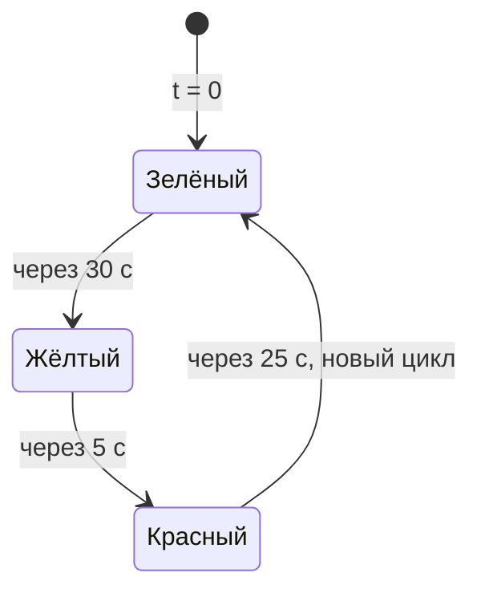
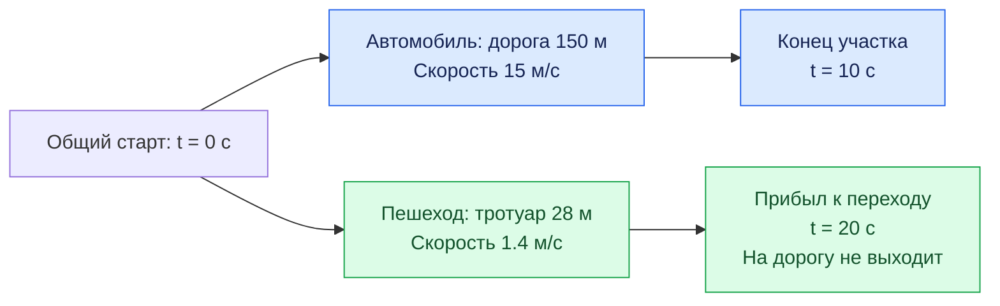
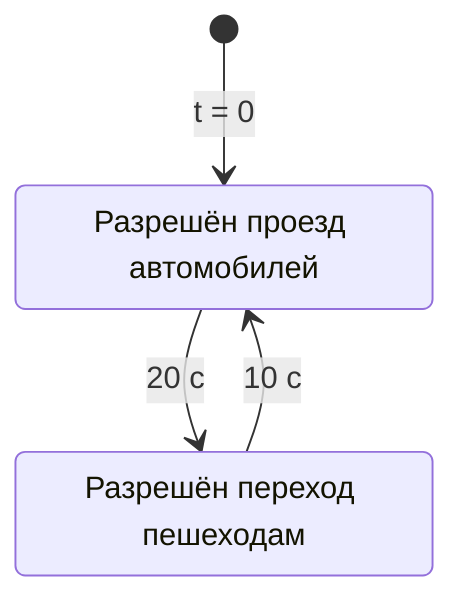
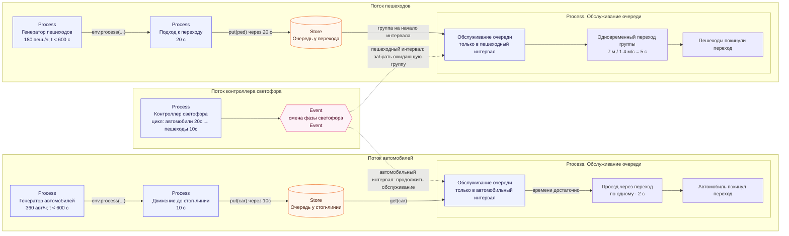
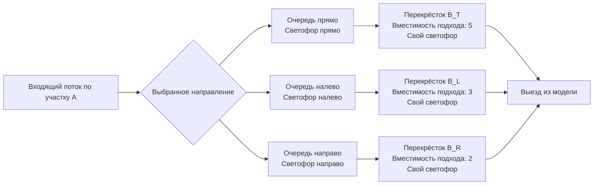

## Этап 1. Познакомиться с возможностями SimPy

### Формальная задача этапа

Научиться представлять систему как набор взаимодействующих дискретных процессов и событий:

$$
S(t) \xrightarrow{\text{event}} S(t')
$$

Время в модели не меняется маленькими шагами. SimPy перескакивает от одного значимого события к следующему. Например:

| время | события |
| ------------------ | ---------------------------------- |
| $t = 12.4$ | автомобиль появился; |
| $t = 18.7$ | автомобиль доехал до перекрёстка; |
| $t = 23.0$ | загорелся зелёный; |
| $t = 24.8$ | автомобиль покинул очередь; |
| $t = 37.1$ | автомобиль достиг следующего перекрёстка. |

## Что рабочая группа должна освоить в SimPy

### Основные обьекты

| SimPy обьект | что представляет |
| ------------------ | ---------------------------------- |
| `Process` | процессы представляют из себя активные обьекты. Например: автомобили, пешеходы, светофоры, посетители магазина, запросы в службу поддержки |
| `Event` | события. Процессы используют отправку и реакцию или обработку событий для того чтобы организовать взаимодействие друг с другом или с Environment. Примеры событий: поступил новый запрос с службу поддержки или загорелся красный свет светофора или автомобиль появился на вьезде в перекресток |
| `Timeout` | Event специального типа, представляет из себя событие "прошел определенный промежуток времени". Такие событие позволяют процессу засыпать на заданное время, потом просыпаться. Или будить другие процессы |
| `Environment`      | Environment это среда проведения экспериментов, которая отвечает за координацию работы процессов |

Материалы: 
1. [SimPy - Basic Concepts](https://simpy.readthedocs.io/en/latest/simpy_intro/basic_concepts.html)
2. [SimPy — Process Interaction](https://simpy.readthedocs.io/en/latest/simpy_intro/process_interaction.html)

### Ресурсы совместного использования

Ресурсы совместного использования — ещё один способ моделировать взаимодействие процессов. В SimPy предусмотрены три категории ресурсов.

| Тип | Что моделирует | Основные операции | Пример |
| --- | --- | --- | --- |
| `Resource` | управляет доступом. Ограниченное число мест, которые процессы временно занимают | `request()` — занять; `release()` — освободить | Две заправочные колонки: одновременно обслуживаются два автомобиля |
| `Container` | управляет количеством. Запас однородного содержимого, выраженный числом | `put(n)` — добавить количество; `get(n)` — забрать | Бак с топливом: добавить 100 литров, забрать 20 |
| `Store` | Набор отдельных объектов | `put(obj)` — положить объект; `get()` — получить объект | Очередь автомобилей, у каждого есть ID, маршрут и время прибытия |

Во всех трёх случаях процесс может ждать через `yield`:
* у `Resource` — освобождения места, 
* у `Container` — достаточного количества или свободной ёмкости, 
* у `Store` — появления объекта или места для добавления. Обычный `Store` выдаёт объекты в порядке поступления — FIFO.

В проекте это можно применять так:

- **`Resource(capacity=1)`** — участок, через который одновременно проезжает один автомобиль. Автомобиль занимает его на время проезда, затем освобождает.
- **`Container(capacity=5, init=5)`** — пять свободных мест на участке. При резервировании выполняется `get(1)`, при выезде — `put(1)`. `level` показывает число свободных мест.
- **`Store()`** — очередь перед переходом. В ней хранятся сами объекты автомобилей или пешеходов; обслуживающий процесс забирает следующий через `car = yield queue.get()`.

У `Resource` значение `capacity` ограничивает число **одновременных пользователей**, а очередь ожидающих может быть длиннее. У `Container` хранится только количество; у `Store` сохраняются данные каждого объекта.

Материалы:

[SimPy — Ресурсы совместного использования](https://simpy.readthedocs.io/en/stable/topical_guides/resources.html)

### Monitoring

Сбора статистики модели.

Материалы:
  [SimPy — Monitoring](https://simpy.readthedocs.io/en/stable/topical_guides/monitoring.html)

## Учебные материалы

SimPy documentation

1. https://simpy.readthedocs.io/en/latest/topical_guides/environments.html
2. https://simpy.readthedocs.io/en/latest/topical_guides/events.html
3. https://simpy.readthedocs.io/en/latest/topical_guides/resources.html

Subject specific tutorials 
1. https://pythonhealthdatascience.github.io/intro-open-sim/lab/index.html
2. https://jckantor.github.io/cbe30338-2021/07.01-Introduction-to-Simpy.html
3. https://des.hsma.co.uk/intro_to_des_concepts.html

## Упражнения

Сначала моделируется цикл одного светофора. Затем упражнения последовательно собирают модель одной улицы: автомобили едут по дороге, пешеходы подходят по тротуару к регулируемому переходу и пересекают проезжую часть. Время измеряется в секундах, расстояние — в метрах, скорость — в метрах в секунду. Все числа ниже — учебные параметры, а не рекомендации по организации реального движения.

### 1. Симуляция одного светофора

**Задача.** Смоделировать один светофор, который сначала горит зелёным, затем жёлтым, затем красным и повторяет эту последовательность. Вывести журнал переключений с модельным временем.

**Условия:**

- в момент $t=0$ включается зелёный сигнал;
- зелёный горит 30 с, жёлтый — 5 с, красный — 25 с;
- после красного сразу включается зелёный и начинается следующий цикл; длительность полного цикла — 60 с;
- одновременно включён ровно один сигнал;
- моделирование длится 180 с; в этом упражнении рассматривается только переключение сигналов самого светофора.

Диаграмма состояний светофора:

**Что реализовать:**

1. Создать среду `simpy.Environment`.
2. Написать функцию-генератор `traffic_light(env, green_duration, yellow_duration, red_duration)` с повторяющимся циклом переключений.
3. При включении каждого сигнала сначала записывать его цвет и `env.now`, затем ожидать его длительность через `yield env.timeout(duration)`. Первая запись о зелёном должна появиться в момент $t=0$.
4. Зарегистрировать процесс через `env.process` и запустить моделирование вызовом `env.run(until=180)`.

**Проверка результата.** Журнал должен содержать следующие включения сигналов:

| Сигнал | Моменты включения, с |
| --- | --- |
| Зелёный | 0, 60, 120 |
| Жёлтый | 30, 90, 150 |
| Красный | 35, 95, 155 |

Всего получается девять записей за три цикла. Переключение в момент $t=180$ с не попадает в журнал: при числовом `until` SimPy останавливается до обработки событий на этой границе.

**Что освоить:** функцию-генератор, `yield`, `env.timeout`, `env.now`, `env.process`, повторение процесса и ограничение времени симуляции.

**Материалы:** [DataCamp — Introduction to the SimPy package](https://projector-video-pdf-converter.datacamp.com/30360/chapter2.pdf), слайды 3–7: генераторы, основные методы SimPy и пример светофоров. Остановка по времени описана в [SimPy — Environments](https://simpy.readthedocs.io/en/latest/topical_guides/environments.html).

### 2. Автомобиль едет по дороге, пешеход подходит к переходу

**Задача.** Смоделировать одновременное движение одного автомобиля по участку дороги и одного пешехода по тротуару до перехода. Определить, когда каждый участник достигнет конца своего участка пути.

**Условия:**

- в момент $t=0$ автомобиль въезжает на участок дороги длиной $L_{\mathrm{car}}=150$ м со скоростью $v_{\mathrm{car}}=15$ м/с;
- одновременно пешеход начинает идти по тротуару к переходу: ему осталось $L_{\mathrm{ped}}=28$ м, его скорость $v_{\mathrm{ped}}=1.4$ м/с;
- оба движутся с постоянной скоростью и пока не взаимодействуют; пешеход завершает движение у края проезжей части, не выходя на дорогу.

Время движения каждого участника:

$$
t_{\mathrm{travel}}=\frac{L}{v}.
$$

**Схема движения.** Обе ветви запускаются одновременно в одной среде моделирования.

**Что реализовать:**

1. Создать одну среду `simpy.Environment` и два процесса: движение автомобиля и движение пешехода.
2. В каждом процессе записать время старта, дождаться `env.timeout(L / v)` и записать время прибытия.
3. Запустить оба процесса через `env.process` до начала выполнения симуляции.
4. Вывести журнал: время, тип участника, событие «начал движение» или «прибыл».

**Проверка результата.** Автомобиль завершает участок в момент $t=10$ с, пешеход приходит к переходу в момент $t=20$ с. Общее модельное время — 20 с: процессы идут одновременно, их длительности не складываются.

**Что освоить:** `env.now`, `yield`, `env.timeout`, `env.process` и совместное выполнение процессов в одной среде.

### 3. Потоки автомобилей и пешеходов на одной улице

**Задача.** Вместо двух заранее заданных участников смоделировать случайное появление автомобилей на въезде и пешеходов на тротуаре. Каждый новый участник должен самостоятельно пройти путь из условий упражнения.

**Условия:**

- автомобили появляются с интенсивностью 360 автомобилей в час;
- пешеходы появляются с интенсивностью 180 пешеходов в час;
- оба генератора независимы; перед первым появлением, как и перед последующими, генератор ждёт случайный интервал;
- новые участники появляются в течение 600 с, после чего генераторы прекращают работу, а уже появившиеся участники заканчивают путь;
- длины участков и скорости остаются прежними; остановок и взаимодействий пока нет.

Интенсивности в единицах модельного времени:

$$
\lambda_{\mathrm{car}}=\frac{360}{3600}=0.1\ \mathrm{s}^{-1},
\qquad
\lambda_{\mathrm{ped}}=\frac{180}{3600}=0.05\ \mathrm{s}^{-1}.
$$

Интервалы между появлениями:

$$
\Delta t_{\mathrm{car}}\sim\mathrm{Exp}(\lambda_{\mathrm{car}}),
\qquad
\Delta t_{\mathrm{ped}}\sim\mathrm{Exp}(\lambda_{\mathrm{ped}}).
$$

**Что реализовать:**

1. Написать отдельные процессы-генераторы автомобилей и пешеходов.
2. Получать интервал через `random.expovariate(lam)`, передавая интенсивность в секунду. Если следующее появление приходится на момент $t\ge600$ с, завершать генератор.
3. При каждом появлении присваивать участнику уникальный идентификатор и запускать его процесс движения, не дожидаясь завершения предыдущего участника.
4. Сохранять время появления и прибытия каждого участника; использовать фиксированный seed для воспроизводимости.

**Проверка результата.** При повторном запуске с тем же seed журнал совпадает. Каждый автомобиль проводит в пути 10 с, каждый пешеход — 20 с. За 600 с ожидается в среднем 60 автомобилей и 30 пешеходов, но в отдельном запуске количество случайно и не обязано совпадать с этими значениями. После завершения всех процессов число прибывших равно числу появившихся отдельно для каждого типа участников.

**Что освоить:** процессы-генераторы, случайные интервалы, единицы интенсивности и одновременное движение многих участников.

### 4. Очереди перед регулируемым пешеходным переходом

**Задача.** Добавить в конец автомобильного участка регулируемый пешеходный переход со светофором. Автомобили должны останавливаться перед ним, а пешеходы — ждать у края дороги. Организовать их движение так, чтобы разрешённые интервалы светофоров не пересекались.

**Условия:**

- использовать потоки и времена подхода из упражнения 3;
- автомобиль после 10с движения присоединяется к очереди перед стоп-линией, пешеход после 20с ходьбы — к очереди у перехода;
- с момента $t=0$ повторяется цикл светофора длительностью 30с: первые 20с разрешён проезд автомобилей, следующие 10с отведены пешеходам;
- проезд одного автомобиля через переход занимает 2с; автомобили обслуживаются по одному в порядке прибытия;
- ширина перехода — 7м, скорость пешехода — 1.4м/с, поэтому переход занимает 5с;
- в начале пешеходного интервала все уже ожидающие пешеходы начинают переход одновременно; пришедшие позже ждут следующего цикла;
- автомобиль может начать проезд только тогда, когда успеет завершить его до конца автомобильного интервала. Завершить проезд ровно на границе интервала допустимо.

В этом упражнении используется упрощённый цикл светофора из двух разрешённых интервалов. Жёлтые фазы в модели движения, защитные интервалы и полноценная логика контроллера светофора появятся на этапе 2 проекта.

**Диаграмма состояний светофора:**

**Что реализовать:**

1. Создать две очереди `simpy.Store`: для автомобилей и пешеходов, достигших перехода. 
2. Написать процесс контроллера светофора, который хранит текущий разрешённый интервал и сообщает о его смене через `Event`.
3. Написать процесс обслуживания автомобильной очереди: дождаться разрешения, проверить остаток интервала и пропускать автомобили последовательно.
4. Написать процесс обслуживания пешеходной очереди: в начале пешеходного интервала выбрать ожидающую группу и смоделировать её переход.
5. Записывать для каждого участника время входа в очередь, начала и завершения проезда или перехода.
6. После отключения генераторов продолжать обслуживание до выхода всех участников, затем завершать симуляцию.

### Модель автомобиля и пешехода

Автомобили и пешеходы удобно моделировать в виде двух классов - Vehicle и Pedestrian с общим предком Participant. 
Participant содержит id, скорость передвижения и общие мониторинговые данные (времена прохождения различных этапов):

- `id`;
- `velocity`;
- `created_at`;
- `finished_at`.
- `queue_entered_at`;
- `queue_left_at`;

Минимальное состояние `Vehicle` который наследует данные `Participant`:

- `current_segment`;

Жизненный цикл `Vehicle`:

1. Появиться на входе сети.
2. Занять место на `RoadSegment`.
3. Провести на участке $t_{\mathrm{free}}$.
5. Встать в очередь соответствующего движения.
6. Дождаться разрешающей фазы светофора.
7. Дождаться свободного места на выездном участке.
8. Занять следующий участок.
9. Только после этого освободить место на предыдущем участке.

Жизненный цикл `Pedestrian`:

1. Появиться на подходе к перекрестку.
2. Встать в очередь перед перекрестком.
3. Дождаться разрешающей фазы светофора.
4. Перейти переход
5. Покинуть перекресток

**Потоки данных и событий:**

**Проверка результата.** Сначала отключить случайные генераторы и задать прибытия непосредственно к переходу: три автомобиля в момент $t=0$ и два пешехода в момент $t=1$ с. Автомобили проходят в интервалах 0–2, 2–4 и 4–6 с; пешеходы ждут до $t=20$ с и переходят в интервале 20–25 с. Затем включить случайные потоки и проверить сохранение FIFO для автомобилей, отсутствие движения на запрещённом интервале и отсутствие одновременного нахождения автомобилей и пешеходов на переходе.

**Что освоить:** `Store`, FIFO, ожидание событий, взаимодействие процессов и отделение движения от ожидания в очереди.

### 5. Ограниченная вместимость участка A перед переходом

**Задача.** Продолжить модель упражнения 4: ограничить число автомобилей на подъезде к регулируемому переходу. Показать, как заполнение участка A задерживает въезд следующих автомобилей.

**Условия:**

- участок A — подъездная дорога перед переходом; он вмещает не более пяти автомобилей;
- место на A считается занятым с момента въезда до полного завершения проезда через переход. В ограничение входят автомобили в движении, в очереди перед стоп-линией и проезжающие переход;
- если A заполнен, новые автомобили ждут во внешней FIFO-очереди перед въездом. Они не исчезают из модели и не занимают место на A до разрешения въезда;
- после въезда на A автомобиль едет 10 с до стоп-линии. Время ожидания перед въездом учитывается отдельно;
- цикл светофора, проезд автомобиля за 2 с и правила перехода пешеходов остаются такими же, как в упражнении 4;
- генератор продолжает создавать автомобили по заданному расписанию независимо от заполнения A; ожидание свободного места выполняется отдельным процессом допуска на участок.

**Что реализовать:**

1. Представить свободные места на A через `simpy.Container` с `capacity=5` и `init=5`, а внешнюю очередь — через `simpy.Store`.
2. Написать один процесс допуска: брать следующий автомобиль из внешней очереди, ждать свободное место через `yield free_A.get(1)`, фиксировать время въезда и запускать процесс движения автомобиля. Автомобиль, уже выбранный для допуска, но ещё ожидающий место, по-прежнему считается ожидающим перед въездом.
3. После 10 с движения добавлять автомобиль в очередь перед стоп-линией и обслуживать по правилам упражнения 4. Освобождать место через `yield free_A.put(1)` только после полного завершения проезда через переход.
4. Записывать время появления, въезда на A, прибытия к стоп-линии и выхода из модели. Отдельно вычислять ожидание перед въездом и ожидание перед переходом; отслеживать число занятых мест на A и число автомобилей, ожидающих снаружи.
5. После завершения генерации обслужить все внешние и внутренние очереди, дождаться выхода всех автомобилей и пешеходов и остановить симуляцию.

**Проверка результата.** Отключить случайный генератор автомобилей и задать появление восьми автомобилей перед въездом на пустой участок A в момент $t=0$. Первые пять сразу въезжают, три остаются снаружи. В момент $t=10$ с первые пять достигают стоп-линии. При одинаковом времени появления порядок задаётся идентификаторами автомобилей.

| Автомобили | Время въезда на A, с | Время проезда через переход, с |
| --- | --- | --- |
| 1–5 | 0 для каждого | По очереди: 10–12, 12–14, 14–16, 16–18, 18–20 |
| 6 | 12 | 30–32 |
| 7 | 14 | 32–34 |
| 8 | 16 | 34–36 |

Число занятых мест на A никогда не превышает пяти. Автомобили 6–8 достигают стоп-линии в моменты 22, 24 и 26 с и ждут разрешения до следующего автомобильного интервала. Если два пешехода подошли непосредственно к переходу в момент $t=1$ с, они переходят в интервале 20–25 с. К моменту $t=36$ с все восемь автомобилей покидают модель, а на A снова свободны все пять мест.

**Что освоить:** `Container`, ограничение вместимости, FIFO-допуск на участок, разделение появления и въезда автомобиля, учёт внешней очереди и освобождение места после завершения движения.

### 6. Затор за переходом блокирует проезд автомобилей

**Задача.** Продолжить модель упражнения 4: добавить после перехода второй дорожный участок B, на котором помещается не более пяти автомобилей. Показать, как заполнение B останавливает выпуск автомобилей с участка A перед переходом, даже когда автомобилям разрешён проезд.

**Условия:**

- участок A — дорога перед переходом; для отдельного изучения влияния B считать вместимость A неограниченной;
- участок B вмещает пять автомобилей, включая зарезервированные места для уже начавших проезд через переход;
- после полного въезда на B автомобиль едет по нему 10 с и покидает сеть;
- автомобиль может начать проезд через переход только при разрешённом автомобильном интервале, достаточном остатке времени и наличии места на B;
- место на B резервируется перед началом проезда. Если автомобиль ожидал место и за это время разрешённый интервал закончился, нужно повторно проверить разрешение и не занимать переход в ожидании;
- пешеходы продолжают обслуживаться по правилам упражнения 4: автомобиль, ожидающий место на B, стоит перед переходом и не перекрывает его.

**Что реализовать:**

1. Представить свободные места на B через `simpy.Container` с `capacity=5` и `init=5`.
2. До начала проезда резервировать одно место на B. После завершения проезда переносить автомобиль с A на B, затем моделировать его движение по B.
3. При выходе автомобиля из B возвращать одно свободное место.
4. Записывать число занятых и зарезервированных мест на B, длину очереди на A и время ожидания из-за заполнения B.
5. Выполнить два запуска с одинаковыми появлениями участников: со свободным выходом из B и с временно закрытым выходом в интервале 0–60 с. При закрытом выходе закончившие движение по B автомобили остаются на нём и продолжают занимать места.

**Проверка результата.** Для наглядного отдельного теста поставить восемь автомобилей в очередь на A в момент $t=0$, оставить B пустым и закрыть его выход до $t=60$ с. Первые пять автомобилей займут или зарезервируют все места на B; остальные три останутся перед переходом. Число занятых и зарезервированных мест никогда не превышает пяти. В пешеходные интервалы переход остаётся доступен пешеходам. После открытия выхода из B автомобили снова получают возможность проезда при разрешающем сигнале.

Так проявляется начало spillback: заполненный участок B блокирует выпуск с A. После проверки этой модели можно дополнительно ограничить вместимость A по правилам упражнения 5. Распространение затора до предыдущего перекрёстка добавляется на этапе 2.

**Что освоить:** `Container`, резервирование и освобождение вместимости, повторная проверка условий после ожидания и влияние downstream-затора на очередь перед переходом.

### 7. Три направления движения и согласованные светофоры

**Задача.** Продолжить модель упражнения 6: входящий поток с участка A разделяется на автомобили, едущие прямо, налево и направо. Каждое направление регулируется своим светофором и ведёт к отдельному следующему перекрёстку. Согласовать сигналы и учитывать ограниченную вместимость принимающих участков.

**Схема движения:**

**Условия:**

- параметры появления автомобилей, движения по A и подхода пешеходов взять из упражнения 6. Вместимость A в базовом варианте остаётся неограниченной;
- при появлении каждый автомобиль один раз выбирает направление: прямо с вероятностью 0.5, налево — 0.3, направо — 0.2. Сохранить выбор в объекте автомобиля; при заторе направление не менять;
- после движения по A автомобиль попадает в одну из трёх FIFO-очередей перед стоп-линией. Они представляют отдельные полосы: ожидающий левый поворот не перекрывает движение прямо и направо;
- проезд центрального перекрёстка по любому направлению занимает 2 с. По каждому направлению автомобили обслуживаются по одному;
- три автомобильных светофора центрального перекрёстка управляются одним контроллером по общему 60-секундному циклу. В каждый момент зелёный разрешён только одному автомобильному направлению либо пешеходам; остальные сигналы красные;
- пешеходы начинают переход группой в начале своего интервала и пересекают дорогу за 5 с по правилам упражнения 4. Цикл из предыдущих упражнений заменить следующим:

| Время внутри цикла, с | Разрешённое движение |
| --- | --- |
| 0–24 | Автомобили прямо |
| 24–36 | Автомобили налево |
| 36–48 | Автомобили направо |
| 48–60 | Только пешеходы |

После центрального перекрёстка каждый автомобиль едет 10 с по выбранному участку до следующей стоп-линии. Каждый принимающий перекрёсток моделируется своим подъездным участком, FIFO-очередью и светофором. Проезд его стоп-линии занимает 2 с, после чего автомобиль покидает модель.

| Направление | Принимающий перекрёсток | Вместимость подхода, автомобилей | Зелёный на принимающем перекрёстке, с внутри 60-секундного цикла |
| --- | --- | --- | --- |
| Прямо | B_T | 5 | 12–36 |
| Налево | B_L | 3 | 36–48 |
| Направо | B_R | 2 | 48–60 |

Все контроллеры используют общее модельное время и начало цикла $t=0$; интервалы повторяются каждые 60 с. Зелёный у принимающих перекрёстков сдвинут на 12 с относительно соответствующего направления в центре: 2 с проезда и 10 с движения до следующей стоп-линии. Вне указанного интервала соответствующий сигнал красный. Интервалы включают начало и не включают конец; завершить проезд ровно на границе разрешено. Это учебная схема без отдельных жёлтых фаз.

Вместимость каждого принимающего подхода учитывает занятые и зарезервированные места: от резервирования перед выездом с A до полного завершения проезда следующего перекрёстка. Зелёный в центре разрешает старт только при свободном месте на выбранном подходе и достаточном времени для завершения текущего проезда. Если мест нет, автомобиль остаётся перед центральной стоп-линией; красный на следующем перекрёстке сам по себе не запрещает въезд на его подход, пока там есть место.

**Что реализовать:**

1. Создать три очереди `simpy.Store` для направлений и три `simpy.Container` для свободных мест на принимающих подходах. Для каждого принимающего перекрёстка создать отдельную очередь и процесс обслуживания.
2. Написать общий контроллер трёх центральных сигналов и пешеходного интервала, а также контроллеры принимающих перекрёстков с указанными расписаниями. Сообщать о сменах сигналов через `Event`.
3. Для первого автомобиля каждой очереди проверять свой зелёный, остаток разрешённого времени и место только на выбранном принимающем подходе. Резервировать место перед проездом; после любого ожидания заново проверять условия. Если разрешение потеряно, вернуть уже полученное резервирование или отменить незавершённую заявку на него.
4. После проезда центрального перекрёстка и 10 с движения поставить автомобиль в очередь выбранного принимающего перекрёстка. Выпустить его только на местный зелёный, если до конца интервала хватает 2 с; затем освободить место.
5. Записывать направление, времена ожидания у обеих стоп-линий, задержку из-за заполнения принимающего подхода, его занятость с учётом резервов и число завершивших путь автомобилей по каждому направлению. Использовать фиксированный seed для выбора направлений и входного потока.
6. После остановки генераторов дождаться выхода всех автомобилей и пешеходов, включая ожидающих на принимающих перекрёстках, и завершить симуляцию.

**Проверка результата:**

1. Для проверки расписаний задать по одному автомобилю каждого направления непосредственно перед центральной стоп-линией в момент $t=0$, оставив принимающие участки пустыми:

| Направление | Проезд центрального перекрёстка, с | Прибытие к следующей стоп-линии, с | Проезд принимающего перекрёстка, с |
| --- | --- | --- | --- |
| Прямо | 0–2 | 12 | 12–14 |
| Налево | 24–26 | 36 | 36–38 |
| Направо | 36–38 | 48 | 48–50 |

2. Повторить запуск, заранее заняв все три места на подходе B_L автомобилями у его стоп-линии и запретив их выпуск до $t=120$ с. Левый поворот должен ждать перед центральным перекрёстком даже на свой зелёный. Автомобили прямо и направо проходят по расписанию из таблицы. После снятия запрета B_L обслуживается по своему светофору; левый поворот возобновляется, когда освободится место и наступит следующий разрешённый интервал в центре.
3. Включить случайные потоки. Проверить FIFO внутри каждого направления, соблюдение вместимости 5/3/2 с учётом резервов, отсутствие одновременного разрешения конфликтующих движений и сохранение числа автомобилей: после полного завершения модели число вышедших равно числу созданных. В тесте с предзаполненным B_L отдельно учесть три исходных автомобиля. Частоты выбора направлений при большом числе автомобилей должны приближаться к 0.5/0.3/0.2.

**Что освоить:** разделение потока по маршрутам, отдельные очереди направлений, согласование светофоров, взаимодействие нескольких перекрёстков и блокирование конкретного направления из-за ограниченной вместимости следующего участка.

### Критерий завершения этапа 1

После завершения этапа знаний SimPy достаточно, чтобы переходить к транспортной модели.
