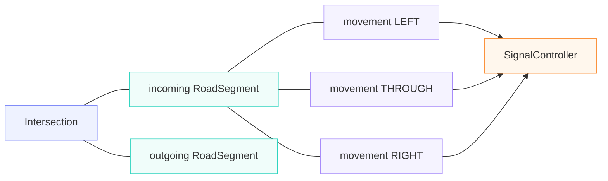

## Этап 2. Модель сети перекрёстков на выдуманных данных

### Базовая формализация модели

Граф модели можно представить в виде NetworkX `DiGraph` примерно так:



Для каждого направленного участка $e$:

$$
e = (u,v)
$$

храним как минимум

$$
L_{e},n_{e},t_{e}^{0},C_{e},N_{e}(t)
$$

где $L$ — длина, $n$ — полосы, $t^{0}$ — свободное время проезда, $C$ — вместимость, $N(t)$ — текущее количество машин.

А поток можно представить как:

$$
\lambda_{e}(t)
$$

кусочно-постоянный на интервалах 5 или 15 минут.

То есть в 7:00–7:15:

$$
\lambda = 420\ \mathrm{veh}/\mathrm{h},
$$

а в 7:15–7:30:

$$
\lambda = 510\ \mathrm{veh}/\mathrm{h}.
$$

При отсутствии индивидуальных времён проезда из таких данных естественно генерировать входы как **piecewise non-homogeneous Poisson process**. Это достаточно серьёзная стохастическая модель для учебной работы и при этом проста для реализации.

Есть одна особенно важная деталь SimPy, которую стоит зафиксировать.

Пусть у участка есть:

```python
free_space = simpy.Container(
    env,
    capacity=capacity,
    init=capacity,
)
```

При въезде автомобиля:

```python
yield segment.free_space.get(1)
```

а при выезде:

```python
yield segment.free_space.put(1)
```

Но место на предыдущем участке надо освобождать **не тогда, когда автомобиль подошёл к светофору**, а только когда он реально пересёк стоп-линию и смог занять следующий участок.

То есть переход логически должен выглядеть так:

* доехал до конца edge A
* встал в очередь LEFT
* дождался разрешающей фазы
* дождался свободного места на edge B
* занял edge B
* освободил место на edge A

Именно это автоматически даёт **обратный поток**:

* B заполнен
* машины не могут уйти из A
* очередь A растёт
* A заполняется
* предыдущий перекрёсток тоже начинает блокироваться

Это, на мой взгляд, одна из самых сильных частей выбранной модели. Мы получаем сетевые заторы без симуляции координат, дистанций и ускорений.

А `simpy.Store` для `left` / `through` / `right` в этом случае содержит автомобили, уже прибывшие к стоп-линии соответствующего движения.

### Формальная задача

Построить минимальную полноценную транспортную дискретно-событийную модель сети нескольких связанных регулируемых перекрёстков, которая содержит почти всю механику будущей реальной модели.

Сеть представляется ориентированным графом:

$$
G = (V,E),
$$

где $V$ — перекрёстки и граничные точки моделируемой области, $E$ — направленные участки дорог.

Минимальная конфигурация должна содержать два последовательных перекрёстка A и B на основной улице и по одному или нескольким боковым направлениям. Между A и B обязательно должен быть участок конечной вместимости, чтобы можно было моделировать взаимодействие перекрёстков и spillback.

### Модель дорожного участка

Для каждого направленного участка $e = (u,v)$ хранятся:

- $L_e$ — длина;
- $n_e$ — число полос;
- $v_e^{\mathrm{free}}$ — свободная скорость;
- $t_e^{\mathrm{free}} = \frac{L_e}{v_e^{\mathrm{free}}}$ — свободное время проезда;
- $C_e$ — вместимость: максимальное число автомобильных мест на участке;
- $N_e(t)$ — число автомобилей, уже занимающих участок, включая движущихся и ожидающих у стоп-линии;
- $R_e(t)$ — число мест, зарезервированных для автомобилей, которые ещё пересекают предыдущий перекрёсток и въезжают на этот участок.

#### Как оценить вместимость

Вместимость показывает, сколько автомобилей может поместиться на участке дороги при плотной очереди. Её можно оценить по длине участка, числу полос и месту, которое занимает одна машина вместе с промежутком до следующей.

**Идея расчёта: вместимость = общая длина всех полос, делённая на место для одного автомобиля, с округлением вниз.**

В формуле это записывается так:

$$
C_e = floor(L_e n_e k_{\mathrm{jam}}).
$$

| Обозначение | Значение |
| --- | --- |
| $L_e$ | Длина участка в метрах |
| $n_e$ | Число полос |
| $k_{\mathrm{jam}}$ | Плотность при заторе: сколько автомобилей помещается на одном метре одной полосы |
| $floor(x)$ | Округление $x$ вниз до целого числа: например, $floor(28.57)=28$ |

Если на один автомобиль вместе с промежутком требуется $d$ метров, то $k_{\mathrm{jam}}=1/d$. Поэтому ту же формулу можно записать через более наглядное расстояние:

$$
C_e = floor\left(\frac{L_e n_e}{d}\right).
$$

**Учебный пример.** Пусть длина участка — 100 м, полос — две, а автомобиль вместе с промежутком до следующего занимает 7 м. Общая длина полос равна $100\cdot2=200$ м, поэтому:

$$
C_e = floor\left(\frac{100\cdot2}{7}\right)
= floor(28.57\ldots)
= 28\ \text{автомобилей}.
$$

В симуляции это означает: когда все 28 мест заняты или зарезервированы, следующий автомобиль должен ждать перед въездом. Вместимость задаётся положительным целым числом автомобилей.

Значение 7 м взято как учебное допущение. На этапе 2 расстояние $d$ или эквивалентную плотность $k_{\mathrm{jam}}$ задают как параметр модели, который позднее можно калибровать.

#### Как вместимость используется в симуляции

Вместимость ограничивает въезд на участок. Индекс $e$ обозначает конкретный участок дороги, а $t$ — текущий момент модельного времени. Для расчёта используются четыре величины:

| Обозначение | Что означает |
| --- | --- |
| $C_e$ | Вместимость участка: сколько автомобилей на нём может находиться одновременно |
| $N_e(t)$ | Автомобили, уже занявшие места на участке $e$: движущиеся по нему и ожидающие у его стоп-линии |
| $R_e(t)$ | Места на участке $e$, заранее зарезервированные для автомобилей, которые ещё находятся на предыдущем участке и пересекают перекрёсток в сторону $e$ |
| $F_e(t)$ | Свободные места на участке $e$, доступные для новых автомобилей |

Зарезервированное место уже нельзя отдать другому автомобилю, хотя зарезервировавшая его машина ещё не въехала на участок. Поэтому число свободных мест равно:

$$
F_e(t) = C_e - N_e(t) - R_e(t),
\qquad
0 \le N_e(t) + R_e(t) \le C_e.
$$

Например, при вместимости пять автомобилей, трёх уже находящихся на участке и одном зарезервированном месте остаётся $F_e=5-3-1=1$ свободное место. После въезда автомобиля его резерв превращается в занятое место: $R_e$ уменьшается на 1, $N_e$ увеличивается на 1, а число свободных мест не меняется.

Один автомобиль занимает одно место независимо от выбранного манёвра. Очереди `left`, `through` и `right` используют общую вместимость участка: постановка автомобиля в очередь у стоп-линии не освобождает его место и не требует занимать второе.

Для перехода с участка $A$ на следующий участок $B$ применяется следующий порядок:

1. Первый автомобиль своей очереди ждёт разрешающую фазу и возможность выпуска с учётом интервала $h_m$. Если $F_b=0$, он остаётся перед стоп-линией на $A$, даже когда горит зелёный.
2. Перед началом проезда перекрёстка резервируется одно место на $B$: $R_b$ увеличивается на 1, а $F_b$ уменьшается на 1. Автомобиль пока продолжает учитываться в $N_a$.
3. После полного завершения проезда и въезда на $B$ резерв превращается в занятое место: $R_b$ уменьшается на 1, $N_b$ увеличивается на 1. Одновременно $N_a$ уменьшается на 1 и на $A$ освобождается место. На $B$ повторно занимать место не нужно.
4. На новом участке автомобиль движется в течение $t_b^{\mathrm{free}}$, затем ждёт у следующей стоп-линии, продолжая занимать место. При окончательном выходе из сети место на последнем участке освобождается.

В SimPy свободные места представляются через `simpy.Container`: для изначально пустого участка `capacity=C_e` и `init=C_e`. Успешный `get(1)` резервирует место, `put(1)` возвращает его при выезде или отмене резервирования. При непустом начальном состоянии `init` равен $C_e-N_e(0)-R_e(0)$. Резервирование должно выполняться одной операцией через контейнер: отдельной проверки `level > 0` недостаточно, поскольку на одно место могут претендовать несколько направлений.

После ожидания места нужно повторно проверить фазу и допустимость выпуска. Если разрешение потеряно до начала проезда, автомобиль остаётся на прежнем участке: полученный резерв возвращается, а незавершённая заявка на резервирование отменяется. Ограничение вместимости проверяется для всех типов светофорного управления.

Если заполнен первый участок сети, новые автомобили ждут во внешней очереди перед въездом. Генератор продолжает воспроизводить заданный входящий спрос; время этого ожидания учитывается отдельно.

**Пример.** При $C_b=5$, $N_b=4$ и $R_b=1$ свободных мест нет: $F_b=0$. Следующий автомобиль не может выехать с $A$ на $B$. Пока $b$ не освободится, очередь на $A$ растёт; если заняты все места и на $A$, блокируется въезд с предыдущего перекрёстка. Так ограничение вместимости создаёт распространение затора против направления движения — spillback.

$C_e$ измеряется в автомобилях и ограничивает число одновременно размещённых автомобилей и резервов. Интенсивность выпуска определяется потоком насыщения $s_m$, светофорными фазами и наличием места на следующем участке. В базовой модели заполнение участка не изменяет $t_e^{\mathrm{free}}$ автоматически: увеличение времени поездки возникает из-за ожидания допуска и очередей.

**Проверка модели.** Во время каждого запуска выполняется $F_e+N_e+R_e=C_e$ для всех участков. Автомобиль в очереди продолжает занимать место; на заполненный участок нельзя въехать; после полного выхода всех автомобилей и снятия резервов на каждом участке снова свободно $C_e$ мест.

### Модель автомобиля и пешехода

Автомобиль и пешехода удобно моделировать в виде двух data классов с общим предком, предка можно назвать Participant.
Participant содержит id, скорость передвижения и общие мониторинговые данные (времена прохождения различных этапов). 

Минимальное состояние `Participant`:

- `id`;
- `velocity`;
- `created_at`;
- `finished_at`.
- `queue_entered_at`;
- `queue_left_at`;

Минимальное состояние `Vehicle` который наследует данные `Participant`:

- `current_segment`;
- `next_segment`;

Жизненный цикл автомобиля:

1. Появиться на входе сети.
2. Занять место на `RoadSegment`.
3. Провести на участке $t_{\mathrm{free}}$.
4. Определить следующий манёвр: прямо, влево, вправо?
5. Встать в очередь соответствующего движения.
6. Дождаться разрешающей фазы светофора.
7. Дождаться свободного места на downstream-участке.
8. Занять следующий участок.
9. Только после этого освободить место на предыдущем участке.
10. Повторять до выхода из сети.

### Ключевое правило spillback

Автомобиль в очереди перед стоп-линией продолжает занимать место на предыдущем `RoadSegment`. Следовательно:


Это позволяет получить сетевой затор без координатной микросимуляции, ускорений и дистанций.

### Очереди манёвров

Для каждого входа к перекрёстку моделируются отдельные movement queues:

- `left`;
- `through`;
- `right`.

Формально движение:

$$
m = (e_{\mathrm{in}},e_{\mathrm{out}}).
$$

Для перекрёстка $v$:

$$
M_v = \{m_1,m_2,\ldots,m_k\}.
$$

Светофорная фаза разрешает набор совместимых movements, а не просто «направление дороги».

Допущение первой версии: очереди `left` / `through` / `right` независимы. Для реальной сети это может завышать пропускную способность, если одна физическая полоса обслуживает одновременно несколько манёвров. В дальнейшем при необходимости можно перейти к `LaneGroup`.

### Пропускная способность зелёной фазы

Включение зелёного не означает мгновенный выпуск всей очереди.

Для каждого `movement` задаётся поток насыщения (saturation flow) $s_m$ — интенсивность выпуска автомобилей при наличии очереди, разрешающей фазе и свободном downstream-участке. Единица измерения — автомобилей в час.

Из него вычисляется интервал между последовательными автомобилями $h_m$. Если численное значение $s_m$ задано в автомобилях в час, то интервал в секундах равен:

$$
h_m = \frac{3600}{s_m}.
$$

Например, при $s_m = 2000$ автомобилей в час:

$$
h_m = \frac{3600}{2000} = 1.8\ \mathrm{s}.
$$

Например, если $h_m = 1.8$ секунды, автомобили проходят стоп-линию последовательно с таким интервалом, пока фаза разрешает движение и downstream-участок имеет свободную вместимость.

### Пешеходы

Пешеходы добавляются уже на этапе 2.

Минимальное состояние `Pedestrian`:

- `arrival_time`;
- `crossing_id`.

Пешеходский поток можно сначала моделировать как:

$$
\Delta t_{\mathrm{ped}} \sim \mathrm{Exp}(\lambda_{\mathrm{ped}}).
$$

Пешеход ожидает разрешающей фазы.

Минимальное время перехода:

$$
t_{\mathrm{cross}} = t_{\mathrm{startup}} + \frac{W}{v_{\mathrm{walk}}},
$$

где $W$ — ширина перехода, $v_{\mathrm{walk}}$ — принятая скорость пешехода.

Контроллер обязан обеспечить достаточное время перехода и не терять запрос: `pedestrian_request` остаётся активным, пока переход фактически не обслужен.

### Три контроллера

Светофоры описываются следующими возможными типами поведения

#### 1. Fixed

Фиксированный цикл, например:

- Main green — 35 s;
- yellow — 3 s;
- clearance — 2 s;
- Side green — 20 s;
- yellow — 3 s;
- clearance — 2 s.

Цикл повторяется независимо от спроса.

#### 2. Binary actuated

Контроллер видит только бинарные датчики:

- $D_m(t) \in \{0,1\}$ — есть машина / нет машины;
- $P_k(t) \in \{0,1\}$ — есть запрос пешехода / нет запроса.

Обязательные ограничения:

$$
g_{\min} \le g \le g_{\max};
$$

- жёлтая фаза;
- защитный интервал;
- запрет конфликтующих movements;
- максимальное ожидание второстепенного направления;
- максимальное ожидание пешехода;
- проверка свободной downstream-вместимости.

Пример логики:

- пока $g < g_{\min}$ — фазу нельзя завершать;
- после $g_{\min}$ при отсутствии спроса на текущей фазе и наличии competing demand можно переключаться;
- при $g \ge g_{\max}$ при наличии competing demand текущая фаза завершается;
- пешеходский запрос сохраняется до обслуживания.

#### 3. Queue-aware

Контроллер имеет количественную информацию:

- $Q_m(t)$ — длина очереди;
- $W_m^{\max}(t)$ — максимальное время ожидания.

Можно определить оценку фазы:

$$
\mathrm{Score}(p) = \alpha \sum_{m \in p} Q_m + \beta \max_{m \in p} W_m.
$$

Далее выбирается наиболее приоритетная допустимая фаза с соблюдением min/max green, yellow, clearance и требований к пешеходам.

Time-of-day на этапе 2 можно не реализовывать как отдельный исследовательский алгоритм. На синтетическом постоянном спросе он почти эквивалентен набору Fixed-программ. Логичнее добавить его на этапе 4, когда появится реальный временной профиль.

### Синтетические сценарии

Нужно проверить не один набор потоков, а несколько режимов:

- Low — низкая нагрузка всех направлений.
- Main-heavy — высокая нагрузка главной улицы, малая боковых.
- Balanced — сопоставимая нагрузка направлений.
- Saturated — высокая нагрузка всех направлений.
- Burst — резкие временные всплески потока.
- Downstream block — сценарий, в котором участок после перекрёстка регулярно заполняется.

Для каждого сценария все контроллеры должны получать один и тот же заранее сгенерированный спрос.

Лучше заранее сгенерировать последовательности arrivals и маршрутов, а потом воспроизводить их для каждого алгоритма. Это сильнее, чем просто одинаковый seed: получается common random numbers и уменьшается дисперсия попарного сравнения.

### Метрики этапа 2

#### Автомобильные

- среднее время поездки;
- средняя задержка;
- P95 задержки;
- средняя и максимальная очередь;
- throughput;
- число незавершивших маршрут автомобилей;
- количество остановок.

#### Пешеходные

- среднее ожидание;
- максимальное ожидание;
- P95 ожидания;
- доля слишком долго ожидающих.

Также нужно писать временные ряды:

`time`, `intersection`, `movement`, `queue_length`.

Это позволит анализировать развитие очереди и spillback во времени.

### Рекомендуемая архитектура системы

```text
simulation/
    vehicle.py
    pedestrian.py
    movement.py
    signal.py
    phase.py

network/
    road_segment.py
    intersection.py

demand/
    arrivals.py
    routes.py
    pedestrians.py

controllers/
    base.py
    fixed.py
    binary_actuated.py
    queue_aware.py

metrics/
    collector.py
    trip_metrics.py
    queue_metrics.py
    pedestrian_metrics.py
```

Главный интерфейс должен быть универсальным:

```python
Simulation(
    network=network,
    demand=demand,
    controller=controller,
)
```

Контроллер не должен знать внутреннее устройство автомобиля.

Его интерфейс должен зависеть от текущего состояния сигналов и доступных ему sensor/queue данных, например:

```python
state = detector_state()

next_phase = controller.decide(
    time=env.now,
    current_phase=current_phase,
    state=state,
)
```

Таким образом одна и та же модель запускается с разными алгоритмами управления.

### Критерий завершения этапа 2

После этапа 2 симулятор не должен знать, является сеть синтетической или реальной. Он получает `Network`, `Demand` и `Controller` и возвращает `Metrics`.

Это основной simulation engine будущего проекта.
