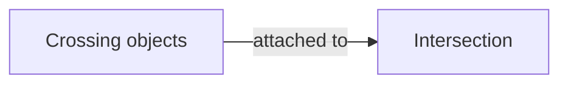
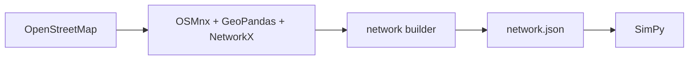

## Этап 3. Построить реальную сеть из OpenStreetMap

### Формальная задача этапа

По выбранной географической области $R$ построить ориентированный граф:

$$
G = (V,E),
$$

где:

- $V$ — логические автомобильные перекрёстки;
- $E$ — однонаправленные дорожные участки между перекрёстками.

Задача этапа 3 — не моделировать движение, а превратить GIS/OSM-данные в стандартный объект `Network`, который уже умеет читать симулятор этапа 2.

### Основные библиотеки

#### OSMnx

OSMnx используется для:

- загрузки дорожного графа из OpenStreetMap;
- получения геометрии и атрибутов дорог;
- упрощения графа;
- работы с направленностью дорог;
- консолидации физически одного перекрёстка, разбитого на несколько OSM nodes;
- получения исторического snapshot OSM;
- сохранения/загрузки графа.

Учебный материал:

[OSMnx — Getting Started](https://osmnx.readthedocs.io/en/stable/getting-started.html)

#### NetworkX

NetworkX используется как основное представление графа после загрузки OSM:

- `DiGraph` / `MultiDiGraph`;
- обход графа;
- маршруты;
- хранение атрибутов рёбер и вершин;
- поиск соседей;
- построение допустимых переходов между сегментами.

Учебный материал:

[NetworkX — Introduction](https://networkx.org/documentation/stable/reference/introduction.html)

#### GeoPandas

GeoPandas используется для пространственных операций:

- точки обследований;
- OSM nodes;
- pedestrian `crossings`;
- CRS;
- spatial join;
- поиск ближайшего OSM-объекта к точке из КСОДД;
- проверка и визуальная отладка соответствий.

Учебный материал:

[GeoPandas — Introduction](https://geopandas.org/en/latest/getting_started/introduction.html)

### Что должно попасть в Network

Для каждого `RoadSegment`:

- `id`;
- `from_intersection`;
- `to_intersection`;
- `osm_id`;
- `length`;
- `lanes`;
- `speed`;
- `free_flow_time`;
- `capacity`;
- `geometry`;
- `road_name`;
- `oneway`.

Для каждого `Intersection`:

- `id`;
- `coordinates`;
- `incoming_segments`;
- `outgoing_segments`;
- `allowed_movements`;
- `has_traffic_signal`;
- `crossings`.

Для каждого `Movement`:

- `incoming_segment`;
- `outgoing_segment`;
- `type` = `left` / `through` / `right`;
- `signal_group` или phase compatibility;
- `lane_group` при наличии.

Для каждого `Crossing`:

- `id`;
- `intersection_id`;
- `geometry`;
- `width` при наличии;
- связанные pedestrian phases.

### Построение графа

Базовый pipeline:

1. Загрузить выбранную область через OSMnx.
2. Оставить drive-сеть.
3. Спроецировать координаты в метрическую CRS.
4. Провести topological simplification.
5. Объединить узлы, относящиеся к одному физическому перекрёстку.
6. Отфильтровать выбранные 3–6 реальных перекрёстков и их соединяющие сегменты.
7. Для каждого сегмента вычислить/дополнить атрибуты, необходимые симулятору.
8. Для каждого перекрёстка построить допустимые movements.
9. Отдельно прикрепить pedestrian `crossings`.

### Проблема: один физический перекрёсток может быть несколькими OSM nodes

На разделённых дорогах один реальный перекрёсток может выглядеть как несколько близких узлов.

Поэтому нужно использовать или адаптировать OSMnx `consolidate_intersections()`, иначе в SimPy вместо одного перекрёстка может случайно появиться несколько искусственных.

### Не смешивать автомобильные перекрёстки и pedestrian crossings

Pedestrian crossing не должен автоматически становиться автомобильной вершиной графа.

Лучше представлять:

Road graph:

- `Intersection`;
- `RoadSegment`.

Отдельно:



Это позволяет независимо моделировать пешеходский запрос и светофорную фазу, не ломая автомобильную топологию.

### Разрешённые манёвры

Для каждого перекрёстка нужно построить:

$$
M_v \subseteq \mathrm{In}(v) \times \mathrm{Out}(v).
$$

Первичную классификацию можно делать по углам между сегментами:

- примерно прямое направление -> `through`;
- положительный/отрицательный поворот -> `left`/`right` в зависимости от принятой системы.

Но обязательно нужно учитывать:

- `oneway`;
- `turn:lanes`;
- запрещённые повороты;
- OSM relation `type=restriction`;
- реальные знаки и ПОДД, если они доступны.

Для сети всего из 3–6 перекрёстков итоговые movements лучше вручную проверить после автоматического построения.

### Число полос

OSM `lanes=*` можно использовать как исходное значение, но оно часто неполное или неоднозначное.

Нужно определить правило:

- если `lanes` заполнено — использовать;
- если нет — взять разумное значение по типу дороги;
- затем вручную проверить исследуемый коридор по спутниковым снимкам/панорамам/ПОДД.

### Исторический OSM

Это особенно важно для Кургана, Калуги и Владивостока, потому что транспортные обследования могут относиться к 2017–2019 годам.

Если измерения были сделаны в 2018 году, желательно строить сеть, максимально близкую к состоянию того времени:

$G_{\mathrm{OSM}}(2018)$, а не $G_{\mathrm{OSM}}(2026)$.

OSMnx позволяет задавать историческую дату для Overpass snapshot. Это снижает риск сравнения старых транспортных измерений с уже перестроенным современным перекрёстком.

### Free-flow time и capacity

Начальное свободное время движения:

$$
t_{\mathrm{free}} = \frac{L}{v_{\mathrm{free}}}.
$$

OSMnx умеет добавлять оценки `speed_kph` и `travel_time`, но для небольшого исследуемого участка эти параметры желательно проверить вручную.

Capacity в SimPy не берётся напрямую из OSM. Она рассчитывается из:

- длины сегмента;
- числа полос;
- принятой jam density;
- при необходимости — особенностей lane groups.

### Артефакт этапа 3

OSMnx и GeoPandas не должны вызываться непосредственно из основного SimPy-кода во время каждого эксперимента.

Лучше сделать отдельный network builder:



Пример структуры `network.json`:

```json
{
  "intersections": [...],
  "segments": [...],
  "movements": [...],
  "crossings": [...]
}
```

### Критерий завершения этапа 3

Выбранный реальный участок города автоматически или полуавтоматически превращается в `Network` того же формата, который уже использовался на этапе 2.

Если заменить синтетический network на `network.json`, simulation engine должен запускаться без изменения внутренней логики автомобилей, очередей и контроллеров.
